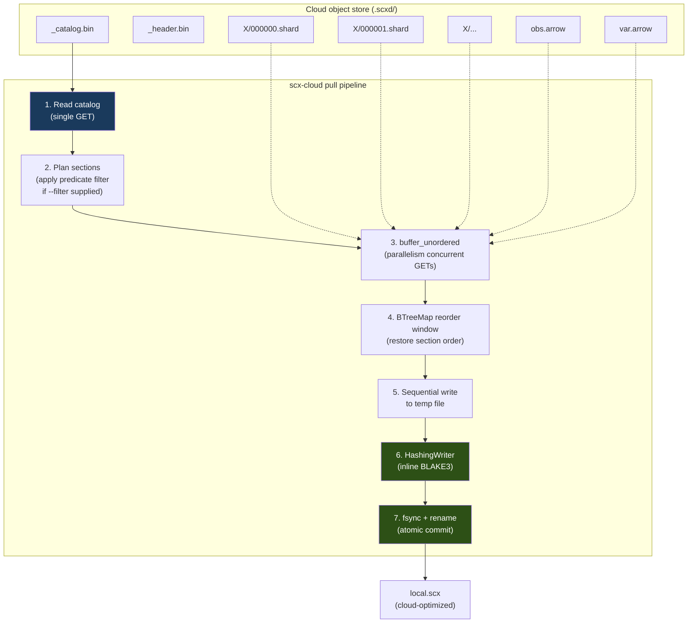

# Using SCX in Cloud Environments

SCX is designed for cloud-native workflows: large atlases live on object storage
(GCS, S3, Azure Blob), and compute nodes pull only what they need — often just
metadata, or just the shards matching a predicate. This guide covers how to set
up credentials, choose the right on-cloud layout, and tune throughput.

For related references:
- [docs/architecture.md §Cloud Operations](architecture.md#cloud-operations-scx-cloud) — crate internals
- [docs/api.md §scx-cloud](api.md#scx-cloud--cloud-operations) — API reference
- [docs/sharding.md §Cloud operations](sharding.md#cloud-operations-shard-level-selectivity) — shard-level selective pull
- [docs/multithreading.md §Cloud I/O](multithreading.md#cloud-io) — concurrency model

## Enabling cloud support

Cloud operations are gated behind the `cloud` feature flag:

```bash
# Rust
cargo build --features cloud
cargo test --workspace --features cloud

# Python bindings
cd pyscx && ../.venv/bin/maturin develop --features hdf5,cloud

# CLI
cargo install --path scx-cli --features cloud
```

Without this flag, `pyscx.pull`, `pyscx.push`, `pyscx.open_cloud`,
`pyscx.read_cloud`, `pyscx.cloud_optimize`, `pyscx.explode`, `pyscx.pack`,
and the `scx pull` / `scx push` / `scx cloud-optimize` / `scx explode` / `scx pack`
subcommands are not available. On a non-cloud CLI build, invoking one of these
fails with `error: unrecognized subcommand 'pull'` preceded by a hint —
`note: \`pull\` is a cloud subcommand and is not compiled into this build.
Rebuild with \`--features cloud\` …` — so a feature-gated command is
distinguishable from a typo. The prebuilt release CLI is built `--features
hdf5-static` (not `cloud`); build/install with `--features cloud` (or
`hdf5,cloud`) to get the cloud subcommands.

## Supported providers and URL schemes

SCX uses the [`object_store`](https://docs.rs/object_store) crate and inherits
its provider support:

| Scheme | Provider | Example |
|--------|----------|---------|
| `gs://`  | Google Cloud Storage | `gs://my-bucket/path/atlas.scxd/` |
| `s3://`  | Amazon S3 (and S3-compatible endpoints)  | `s3://my-bucket/path/atlas.scxd/` |
| `az://`  | Azure Blob Storage | `az://my-container/path/atlas.scxd/` |
| `file://` or bare path | Local filesystem (dev / on-prem) | `/mnt/data/atlas.scxd` |

A URL without a recognized scheme is treated as a local path, which makes it
easy to develop against a local directory and switch to cloud by changing the
URL only.

## Authentication

SCX does not manage credentials itself — it relies on the default credential
chain of `object_store`. Configure your environment the same way you would for
`gcloud`, `aws`, or `az` CLI.

### Google Cloud Storage

```bash
# Service account key file
export GOOGLE_APPLICATION_CREDENTIALS=/path/to/sa-key.json

# Or: run on GCE/GKE/Cloud Run — instance metadata is used automatically
# Or: `gcloud auth application-default login` for local dev
```

#### Benchmark service-account bootstrap (one-time)

The comprehensive benchmark suite expects a dedicated service account
`scx-bench@<project>.iam.gserviceaccount.com` with scoped bucket access.
Run these once per GCP project (requires `roles/iam.serviceAccountAdmin`
+ `roles/resourcemanager.projectIamAdmin`):

```bash
# 1. Pin the project
PROJECT=c-tc-429521
BUCKET=gs://arc-ctc-nextflow
gcloud config set project "$PROJECT"

# 2. Create the service account if absent
if ! gcloud iam service-accounts list \
      --filter="email:scx-bench@$PROJECT.iam.gserviceaccount.com" \
      --format="value(email)" | grep -q .; then
    gcloud iam service-accounts create scx-bench \
        --display-name "SCX Benchmark Runner" \
        --project "$PROJECT"
fi

# 3. Grant bucket-scoped objectAdmin (NOT project-wide)
gcloud storage buckets add-iam-policy-binding "$BUCKET" \
    --member="serviceAccount:scx-bench@$PROJECT.iam.gserviceaccount.com" \
    --role=roles/storage.objectAdmin

# 4. Mint a JSON key and stash locally
mkdir -p ~/.gcp
gcloud iam service-accounts keys create ~/.gcp/scx-bench.json \
    --iam-account="scx-bench@$PROJECT.iam.gserviceaccount.com"
chmod 600 ~/.gcp/scx-bench.json

# 5. Point the benchmark runner at the key via the repo-root .env
#    (auto-loaded by python-dotenv through benchmarks/scripts/bench_env.py
#    — no shell export needed; tilde is expanded on load)
echo 'GOOGLE_APPLICATION_CREDENTIALS=~/.gcp/scx-bench.json' >> .env
```

An uncommented template line is available in `.env.example` for
reference. The env-var precedence is real-env → `.env` → default-path
fallback (`~/.gcp/scx-bench.json`), so operators who prefer to export
the variable in their shell can continue to do so without removing the
`.env` entry.

**Key rotation:** re-mint every 90 days and delete the old key in the GCP
console. Never commit the JSON, paste it into chat, or copy it into the
repo tree.

#### Preflight check

After bootstrapping, verify the setup end-to-end (checks env var,
parses the key, validates service-account identity, round-trips a
healthcheck blob through the bucket):

```bash
python benchmarks/comprehensive/scripts/check_gcp_auth.py -v
```

Exit 0 on success, 1 on any failure with a pointed error message. Use
`--skip-healthcheck` in CI when you want key validation without paying
for a GCS round-trip.

### Amazon S3

```bash
export AWS_ACCESS_KEY_ID=AKIA...
export AWS_SECRET_ACCESS_KEY=...
export AWS_REGION=us-west-2           # required
export AWS_SESSION_TOKEN=...          # if using STS / assumed role

# Or: run on EC2/EKS/ECS — instance profile is used automatically
# Or: `aws sso login` sets up credentials in ~/.aws
```

For S3-compatible endpoints (MinIO, Cloudflare R2, Wasabi), additionally set:

```bash
export AWS_ENDPOINT=https://s3.example.com
export AWS_ALLOW_HTTP=true            # only if endpoint is http://
```

### Azure Blob Storage

```bash
export AZURE_STORAGE_ACCOUNT=myaccount
export AZURE_STORAGE_KEY=...          # shared key
# Or: AZURE_STORAGE_SAS_TOKEN, or managed identity on Azure VMs
```

Credentials are picked up lazily when the first operation runs; misconfigured
credentials surface as a runtime error from the underlying `object_store`.

## Layouts on object storage

SCX has three ways to live in a bucket. Pick based on how you read the data.

| Layout | Structure | Best for | Write via |
|--------|-----------|----------|-----------|
| **Exploded `.scxd/`** | Directory of objects (one per shard/section) | Random / selective access, selective pull, multi-reader parallel download | `pyscx.push(...)` or `scx push` |
| **Cloud-optimized `.scx`** | Single object with front-of-file catalog | Whole-file download; read metadata in one GET | `pyscx.cloud_optimize(...)` → upload the file |
| **Plain `.scx`** | Single object, catalog at EOF | Existing files you haven't cloud-optimized yet | Any upload |

**Default recommendation**: exploded `.scxd/` for datasets that multiple users
or jobs will slice differently, cloud-optimized `.scx` for archive / portable
distribution of a single file.

### Exploded `.scxd/` layout

```
s3://bucket/atlas.scxd/
├── _header.bin               # 256-byte file header
├── _catalog.bin              # Full catalog (uploaded LAST)
├── _modality_table.bin       # Optional — present on multimodal v2 files
├── obs.arrow                 # Cell metadata — single-section obs only
├── obs/                      # Row-sharded obs (ObsMetadataShard); replaces
│   ├── 000000.arrow          #   obs.arrow, never coexists with it
│   └── 000001.arrow
├── var.arrow                 # Gene metadata
├── var/                      # Row-sharded var, when the source has it
├── X/
│   ├── 000000.shard          # Single-modality CSR shards — byte-identical to packed
│   ├── 000001.shard
│   ├── rna/                  # Multimodal: per-modality directory
│   │   ├── 000000.shard
│   │   └── ...
│   ├── adt/
│   │   └── 000000.shard
│   └── ...
├── obsm/                     # Optional embeddings
├── layers/                   # Optional layers
├── uns.json                  # Optional unstructured metadata
├── _provenance.bin           # Optional
└── _deletion_vectors.bin     # Optional
```

A file has **either** `obs.arrow` **or** `obs/NNNNNN.arrow`, never both — the
two on-disk obs layouts are mutually exclusive (see
[format.md § Sharded metadata layout](format.md#sharded-metadata-layout-section-types-2425)).
Since phase 6c the sharded form is what `scx convert` / `pyscx.from_h5ad`
produce by default above `n_obs > shard_size`, so consumers of this layout
must handle both; `scx pull`, `scx pull --filter` and `open_cloud` do.

`_catalog.bin` is uploaded last, which gives the `.scxd/` directory
**atomic-publish semantics**: until the catalog object exists, a reader opening
the URL gets a clean "not found" error rather than a half-written dataset.

### Cloud-optimized packed `.scx`

A cloud-optimized `.scx` is the same format as a local `.scx` plus a **front
catalog** (a duplicate of the full catalog) placed right after the header, so
a reader can bootstrap the file's structure with a single range read (typically
256 KB) instead of first issuing a HEAD and a separate read for the catalog at
EOF. See [docs/format.md §Cloud Layouts](format.md#14-cloud-layouts).

```bash
# One-shot conversion
scx cloud-optimize atlas.scx --output atlas.cloud.scx
# then `gsutil cp atlas.cloud.scx gs://bucket/`
```

```python
pyscx.cloud_optimize("atlas.scx", "atlas.cloud.scx")  # explicit output
pyscx.cloud_optimize("atlas.scx")                      # in-place rewrite
```

`pull` produces a cloud-optimized file by default (`cloud_ready=True`), so
pulling and re-uploading is another way to make a file cloud-ready.

## Operations

### `pull` — stream cloud → local `.scx`

Downloads shard objects in parallel through a bounded `buffer_unordered`
pipeline, streams them into a single local `.scx` file via a reorder
window, and writes the catalog last. Peak memory is bounded by
`parallelism × max_section_size`, **not** by the total file size.



```python
# Full dataset
pyscx.pull("gs://bucket/atlas.scxd/", "atlas.scx")

# Selective shard pull: only shards matching the predicate are downloaded.
# This is shard-granular — the output may include non-matching cells from
# partially matching shards.  Use open_cloud() + local subset for exact
# cell-level filtering.
pyscx.pull(
    "gs://bucket/atlas.scxd/",
    "t_cells.scx",
    filter="cell_type == 'T cell'",
    parallelism=16,
    filter_mode="shard",    # default; "exact" reserved for future release
)
```

```bash
scx pull gs://bucket/atlas.scxd/ atlas.scx --parallelism 16
scx pull gs://bucket/atlas.scxd/ lung.scx --filter "tissue == 'lung'" --filter-mode shard
```

Selective pulls can reduce bandwidth by up to ~20× on well-sharded datasets
(see [docs/sharding.md]), because the catalog's per-shard `CategoryBitset` is
consulted before any shard is downloaded.

**Filter mode.** The `filter_mode` parameter controls the granularity of
the selective pull:

- `"shard"` (default): downloads complete shards containing any matching
  cell. The output may include extra non-matching cells from partially
  matching shards. Fast — no decode/re-encode.
- `"exact"`: not yet implemented (reserved for follow-up). Will decode
  downloaded shards, filter rows, rebase CSR indptr, and write only
  matching cells.

**Omitted sections.** Selective pulls omit section types that cannot be
subset at the shard level without re-indexing (e.g., `ObsmEmbedding`,
`LayerCsrShard`, `ObspCsrShard`). The returned stats dict includes an
`omitted_section_types` key listing what was skipped.

Return value (Python): dict with `bytes_downloaded`, `sections_downloaded`,
`elapsed_secs`, `throughput_mbps`. Filtered pulls add `total_shards`,
`downloaded_shards`, `skipped_shards`, `matching_cells`, `bytes_saved`,
`filter_mode`, `omitted_section_types`.

#### Interrupted pulls — idempotent retry, not resumable

Pulls are **idempotent-retry**, not resumable-from-checkpoint. The
implementation writes to `{dest}.tmp.{pid}` and atomically renames on
completion, so:

- A SIGTERM or crash leaves `{dest}.tmp.{pid}` orphaned on disk but does
  **not** block subsequent pulls — a fresh run uses a different PID-keyed
  path and produces the final output atomically.
- On entry, every `pull` / `pull_filtered` invocation sweeps any
  `{dest}.tmp.*` siblings it finds, so orphaned temp files don't
  accumulate across retries.
- There is **no shard-level checkpoint** — a retried pull re-downloads
  every shard. This is a deliberate design choice: SCX shards are
  independent and small enough that re-download cost is bounded, and a
  checkpoint file would introduce cross-invocation state that defeats
  the current atomic-rename safety property.
- If your pull was killed mid-run and you need to know the committed
  state on disk, check for `{dest}` (fully written) vs `{dest}.tmp.*`
  (in-flight, safe to delete). The next pull will sweep the `.tmp.*`
  automatically.

Interruptions in the streaming pipeline surface as `CloudError::Timeout` /
`CloudError::DownloadFailed` / `object_store::Error` at the failing GET.

### `push` — stream local `.scx` → cloud `.scxd/`

```python
pyscx.push("atlas.scx", "gs://bucket/atlas.scxd/", parallelism=16)
```

```bash
scx push atlas.scx gs://bucket/atlas.scxd/ --parallelism 16
```

Uploads every section as its own object in parallel and uploads `_catalog.bin`
last (atomic-publish semantics). No intermediate local directory is created.
Sections are streamed from the source file in bounded chunks — small sections
(metadata, indexes) via a single `put`, large X / CSC shards via a chunked
multipart upload — so peak memory is `parallelism × 8 MiB` rather than the
source-file size. This lets `push` operate on multi-hundred-GB / TB atlases
that do not fit in host RAM.

**Verify an uploaded file.** Both `scx info` and `scx query` accept the cloud
URL directly (no `scx pull` needed), so the natural post-push sanity check is:

```bash
scx info gs://bucket/atlas.scxd/              # catalog summary over range reads
scx query gs://bucket/atlas.scxd/ --count     # total cell count
scx query gs://bucket/atlas.scxd/ "cell_type == 'T cell'" --count --explain
```

`scx info <url>` reads only the header + catalog (and per-shard headers for the
codec summary), so it is cheap; `scx query --count` confirms the obs schema and
predicate pushdown resolve end-to-end.

### `open_cloud` — metadata-only handle

```python
exp = pyscx.open_cloud("gs://bucket/atlas.scxd/")
exp.n_obs          # 1_200_000
exp.n_vars         # 36_601
exp.shape          # (1_200_000, 36_601)  — mirrors anndata.AnnData.shape
exp.nnz            # 3_400_000_000
exp.shard_count    # 120
```

`open_cloud` auto-detects the layout (exploded / cloud-ready packed / plain
packed) and returns a `CloudExperiment` whose metadata accessors require only
the header + catalog. Use this to decide what to pull before paying for the
bytes.

If the URL points at neither an exploded `.scxd/` directory (with
`_catalog.bin`) nor a packed `.scx` file, `open_cloud` raises
`FileNotFoundError` with an actionable message rather than a raw
provider 404 — a common cause is pointing at a packed `.scx` path that
hasn't been published with `scx push` / `scx explode`.

**Schema discovery.** To learn which columns `filter_obs(...)` accepts
without materializing rows, use `obs_keys()` / `var_keys()` (and the
`.shape` above):

```python
exp.obs_keys()     # ['cell_type', 'tissue', 'disease', 'donor_id', ...]
exp.var_keys()     # ['feature_name', 'feature_type', ...]
```

Caveat: unlike the local `Experiment.obs_keys()` (an Arrow IPC
footer-only read), the **cloud** accessors read obs/var data to derive the
schema. For a sharded obs (atlas scale) `obs_keys()` reads only the *first*
shard — all shards share one schema — so it stays cheap; for a
single-section obs/var it reads that one section, cached on the handle (so a
subsequent `.query()` that reads obs is free).

### Cloud-native query

`CloudExperiment.query()` now returns a `PyQueryPipeline` wired
over the cloud `SectionReader`, so a selective read can resolve
without `scx pull`-ing the whole file first:

```python
exp = pyscx.open_cloud("gs://bucket/atlas.scxd/")
adata = (
    exp.query()
       .filter_obs("cell_type == 'T cell' and tissue == 'lung'")
       .select_genes(hvg)
       .collect()
       .to_anndata()
)
```

The CLI mirrors this via `scx query` — `<input>` accepts a local
`.scx` path, an exploded `.scxd/` directory, or a cloud URL:

```bash
scx query gs://bucket/atlas.scxd/ "cell_type == 'T cell'" \
    --output tcells.scx
scx query gs://bucket/atlas.scxd/ "cell_type == 'T cell'" \
    --count --json
```

Predicate evaluation uses, in order:

1. predicate-index sections when present
   (`scx convert --index-obs cell_type,…` or
   `--index-preset cellxgene` at write time — see
   [docs/api.md § Conversion-time predicate indexes and detection bitmaps](api.md#conversion-time-predicate-indexes-and-detection-bitmaps)),
2. catalog shard statistics otherwise,
3. a full obs scan as a fallback.

The planner then issues parallel range reads (cloud-optimized packed)
or independent shard-object GETs (exploded `.scxd/`) for only the
matching sections; decode reuses the local engine code path.

Plain packed `.scx` (no front catalog) also works — `open_cloud`
range-reads the EOF catalog on open, with one extra round-trip
relative to a cloud-optimized layout.

**Sharded obs/var metadata** (`ObsMetadataShard` / `VarMetadataShard`,
section types 24–25) emitted by `merge`, `append`, and `from_anndata`
(when `n_obs > shard_size`) is supported on the cloud path:
`open_cloud(...).query()` assembles the per-shard sections over parallel
range reads (the same upcast → cover-validation → concat → downcast
pipeline the local reader uses, via `scx_format_io::assemble_sharded_metadata`)
and returns results identical to the local in-process query. The single
file-scope `ObsPredicateIndex` is read unchanged, so catalog-level
predicate pushdown still applies.

#### `pyscx.read_cloud(...)` — one-liner cloud read

The flat helper mirroring `scanpy.read_h5ad` for cloud sources — it
wraps `open_cloud(url).query()…collect().to_anndata()`:

```python
import pyscx

# Whole file:
adata = pyscx.read_cloud("gs://bucket/atlas.scxd/")

# Predicate-pushed subset (only matching shards are fetched):
adata = pyscx.read_cloud(
    "gs://bucket/atlas.scxd/",
    obs_filter="cell_type == 'T cell' and tissue == 'lung'",
    var_names=["CD3D", "CD8A", "IL7R"],   # resolved against the file's var index
)
```

`obs_filter` is an obs predicate expression; `var_names` is a list of gene
names resolved to indices against the file's `var`. Normalization / log1p
transforms are not exposed on `read_cloud` — build the explicit
`open_cloud(url).query()` chain (`.with_normalize()` / `.with_log1p()`) when
you need them. Returns a regular `anndata.AnnData`. `file://` URLs and local
paths work too, so the same call serves local exploded directories.

> **Caveat — stale index after append.** Unless `scx append` is given
> `--index-obs`/`--index-var`/`--index-preset` (which rebuild the predicate
> index over the full output), the file-scope predicate index covers only the
> original rows; it is *not* auto-merged across the appended shards. A cloud
> query over such a file falls back to a full obs scan of the appended rows
> (correct, but slower). Rebuild the index on append, or treat the
> incremental delta-index design as a separate follow-on.

**Deferred to follow-on PRs:**

- `CloudQueryOptions` (parallelism, max-inflight bytes, cache-dir,
  retry policy) — today's cloud reads inherit the same retry layering
  documented under [Tuning throughput](#tuning-throughput) but are
  not yet individually configurable for the query path.
- A batched async section fetcher; today each cloud read uses
  `block_on` from a rayon worker, so cloud bandwidth is bounded by
  the rayon thread pool rather than fully saturated.
- Incremental per-shard predicate-index merge so appended shards are
  covered without a full index rebuild (see the append caveat above).

### `explode` / `pack` — convert layouts locally

```bash
scx explode atlas.scx atlas.scxd/      # packed → exploded
scx pack    atlas.scxd/ atlas.scx      # exploded → packed
```

Useful for preparing an upload locally (upload a directory with `gsutil rsync`)
or for inspecting an exploded directory that someone else published.

## Choosing the right access pattern

```
                                    ┌─ Read the whole dataset once per node?
                                    │    └─ `pull`, then work from the local .scx
                                    │
Multiple nodes, ML training ────────┼─ Each reads a random slice?
                                    │    └─ Exploded .scxd + `pyscx.pull(..., filter=...)`
                                    │       per node, or the training loader
                                    │
Interactive exploration ────────────┼─ Just need to know if this dataset has T cells?
                                    │    └─ `pyscx.open_cloud` — catalog-only, cents per query
                                    │
Distribution / archive ─────────────┴─ Publishing one file for others to download?
                                         └─ `cloud_optimize` + upload as a single .scx
```

Heuristics:

- **Always prefer selective pull** when you have a clear predicate (`cell_type`,
  `tissue`, `batch`). It scales inversely with selectivity, and egress cost is
  usually the bottleneck, not compute.
- **Cloud-optimize once, distribute many times.** For a published atlas that
  users will download whole, `cloud_optimize` saves one round-trip per reader.
- **Exploded `.scxd` is better for ML training** — independent shard objects
  allow parallel, resumable downloads and shard-level caching.

## Tuning throughput

| Knob | Default | When to change |
|------|---------|----------------|
| `parallelism` on `pull` / `push` | 8 | Raise to 16–32 on high-bandwidth links (10+ Gbps) or large shard counts. Diminishing returns past #cores. Also bounds the in-flight window — on `pull`, peak memory is `parallelism × max_section_size`; on `push`, sections stream in chunks so peak memory is `parallelism × 8 MiB` regardless of section size. |
| `--filter-mode` / `filter_mode` | `shard` | Shard-granular (fast, may include extra cells). `exact` reserved for future release. |
| `retry_config.request_timeout` | 120 s | Per-request wall-clock cap. A timed-out request is retried subject to `max_retries`; final exhaustion surfaces as `CloudError::Timeout`. Raise on slow links pulling very large shards. |
| `retry_config.max_retries` | 6 | Total retry attempts per request. Effective attempt count is exactly `max_retries + 1`. Lower to 0–1 to fail fast in CI; raise on flaky networks. |
| `retry_config.base_delay` / `max_delay` / `jitter_factor` | 500 ms / 30 s / 0.1 | Exponential backoff schedule with ±10% jitter for breaking thundering-herd. Defaults rarely need tuning. |
| Shard size at write time | 10k cells | Smaller shards → finer pushdown granularity, but more objects and more request overhead. See [docs/sharding.md]. |
| `RAYON_NUM_THREADS` | #cores | Affects downstream decode after download. Does **not** control download parallelism — that's `parallelism`. |

#### Retry layering

Every cloud read — `pull`, cloud query (`CloudReader`), metadata reads,
predicate-index and deletion-vector reads — goes through a single
`RetryingStore` decorator installed at the `ObjectStore` boundary.
`RetryingStore` wraps every `get_opts` (and `head`) call with a
per-request `tokio::time::timeout` deadline and application-classified
retry/backoff (`RetryConfig`). `object_store`'s own internal retry is
**disabled** (`max_retries: 0`) at backend construction, so
`RetryingStore` is the sole retry authority — there is no
`outer × inner` attempt compounding; the effective attempt count is
exactly `max_retries + 1`. To disable retries entirely, pass
`retry_config = RetryConfig::disabled()`.

### Request cost vs. bandwidth cost

Cloud providers charge per-request *and* per-byte. A dataset exploded into many
tiny shards optimizes selectivity but can be request-heavy. For dense reads
(pull the whole thing), a single cloud-optimized `.scx` is cheaper: ~3 GET
requests (header + front catalog + body range) vs one GET per shard.

Coalescing (docs/cloud.md (Range coalescing)) is used internally when reading ranges from a packed
file — adjacent sections are merged into single GETs with a configurable gap
threshold, which further reduces request count.

## Running on cloud compute

### Google Cloud (GCE / GKE / Batch / Vertex)

- Attach a service account with `storage.objectViewer` (read) or
  `storage.objectAdmin` (read/write) on the bucket. No env var needed —
  instance metadata is picked up automatically.
- Use the same region for compute and bucket to avoid egress charges.
- For Vertex AI Training, set the bucket via `gcsfuse` or just read with
  `pyscx.pull(...)` — the latter is faster than gcsfuse for SCX reads.

### AWS (EC2 / EKS / Batch / SageMaker)

- Attach an instance profile / IRSA role with `s3:GetObject` + `s3:ListBucket`
  (read) or also `s3:PutObject` + `s3:AbortMultipartUpload` (push). No env vars
  needed when the role is attached.
- Pin `AWS_REGION` — `object_store` does not auto-discover it from the instance
  profile in all cases.
- Prefer VPC endpoints (`com.amazonaws.<region>.s3`) for private-subnet nodes
  to avoid NAT gateway cost.

### Azure (VMs / AKS / ML)

- Enable a system-assigned or user-assigned managed identity on the VM / AKS
  node pool and grant `Storage Blob Data Reader` / `Contributor` on the
  container.
- `AZURE_STORAGE_ACCOUNT` still needs to be set — the managed identity only
  supplies the secret, not the account name.

### Shared filesystems on HPC (Lustre / GPFS / NFS)

SCX works directly on shared filesystems without the cloud code path —
advisory `flock()` degrades gracefully when not supported, and readers never
block (see [docs/multithreading.md §Concurrent file access]). Use local paths,
not `gs://` / `s3://`, in this case.

## GIL release and concurrency

`pyscx.pull`, `pyscx.push`, and `pyscx.open_cloud` all release the GIL while
blocking on cloud I/O, so a Python process can overlap cloud downloads with
other work (e.g., pulling multiple datasets concurrently via threads). The
underlying tokio runtime fans out `parallelism` async tasks; see
[docs/multithreading.md §Cloud I/O].

## Troubleshooting

| Symptom | Likely cause | Fix |
|---------|-------------|-----|
| `InvalidUrl("unsupported scheme ...")` | Wrong scheme, e.g., `https://` | Use `gs://` / `s3://` / `az://` or a local path |
| `ObjectNotFound` on `open_cloud` | `.scxd/` not fully published (no `_catalog.bin`) | Wait for the `push` to finish or re-run it |
| S3 403 with valid keys | Region mismatch | Set `AWS_REGION` to the bucket's region |
| `pull` slow, CPU idle | Few shards, low `parallelism` | Raise `parallelism`, or re-shard the source (smaller shards at write time) |
| `pull` slow, CPU at 100% | Decompression-bound, not I/O-bound | Already saturating — use a larger instance or a different codec (Zstd is slower than Scx1) |
| High request bill | Too many tiny shards, many exploratory `open_cloud` calls | Increase shard size on write; cache `CloudExperiment` handles |
| Credentials picked up from wrong source | Shell has stale env vars + instance profile | Unset `AWS_*` / `GOOGLE_APPLICATION_CREDENTIALS` to force the instance credential path |

## End-to-end example

```python
import pyscx

# 1. Peek at a published atlas without downloading
exp = pyscx.open_cloud("gs://arc-atlases/tabula_sapiens.scxd/")
print(exp.n_obs, exp.n_vars, exp.shard_count)

# 2. Pull only lung cells
stats = pyscx.pull(
    "gs://arc-atlases/tabula_sapiens.scxd/",
    "lung.scx",
    filter="tissue == 'lung'",
    parallelism=16,
)
print(stats)  # {'downloaded_shards': 7, 'skipped_shards': 113, ...}

# 3. Work locally as usual
adata = pyscx.open("lung.scx").to_anndata()

# 4. Publish a derived dataset back to cloud as .scxd/
adata.write_scx("lung_pca.scx")
pyscx.push("lung_pca.scx", "gs://my-bucket/lung_pca.scxd/", parallelism=16)
```

---

## Benchmark modules

The comprehensive benchmark suite (`benchmarks/comprehensive/`) includes
eight modules that exercise the cloud surface end-to-end. Each writes one
JSON per `(benchmark × format × dataset)` under `results/raw/`; the
reporting layer pivots them into cross-format tables automatically.

| Module | Scope | What it measures |
|---|---|---|
| `cloud_push` | SCX only | Push throughput: local `.scx` → `gs://…/.scxd/` via `pyscx.push`. Cleanup per-run. |
| `cloud_pull` | SCX only | Pull throughput: `gs://…/.scxd/` → local `.scx` via `pyscx.pull` (streaming + pack). |
| `cloud_read` | cross-format | Full-dataset materialization from the cloud URI for every format that declares `cloud_read`. |
| `cloud_metadata` | cross-format | Catalog-open latency (`open_cloud` / `open_consolidated` / `Experiment.open` / `SLAFArray`). |
| `cloud_filtered` | cross-format (obs-preserving) | Predicate pushdown at cloud scale: `cell_type == "T cell"`, `n_counts > 1000`, random 1% sample. Zarr silently skipped (converter doesn't preserve obs). |
| `cloud_reader_vs_pull` | SCX only | Decision table: `open_cloud` (metadata-only) vs full `pyscx.pull`, plus predicate sweep at 5% / 20% / 80% selectivity comparing `pyscx.pull(filter=…)` to a full pull. |
| `cost_model` | SCX only | USD per 1M cells queried for each cloud layout (exploded `.scxd` today) across metadata + selective + full-read scenarios, using the GCS rate card pinned in `config.py::GCS_PRICING`. |
| `cloud_large_atlas` | SCX only | Correctness check: streaming pull of a 50 GB+ atlas must stay within the 240 MB peak-RSS bound. Fails loudly on violation — this is a regression test, not a throughput run. |

Entry points for running any combination:

```bash
# GCP auth preflight (required before first run)
python benchmarks/comprehensive/scripts/check_gcp_auth.py

# Stage cloud fixtures (one-time, BLAKE3-idempotent)
bash benchmarks/comprehensive/scripts/setup_cloud_test_data.sh

# Cross-format cloud suite
python benchmarks/comprehensive/scripts/run_parallel.py \
    --benchmarks cloud_read cloud_metadata cloud_filtered cloud_reader_vs_pull \
                 cost_model cloud_push cloud_pull \
    --datasets pbmc3k tabula_sapiens_100k \
    --formats scx_auto zarr_zstd tiledb_soma slaf

# Large-atlas peak-RSS regression
python benchmarks/comprehensive/scripts/run_parallel.py \
    --benchmarks cloud_large_atlas --datasets census_10m --formats scx_auto

# GCP instance matrix (requires --yes-spend)
python benchmarks/comprehensive/scripts/submit_gcp_matrix.py --dry-run
python benchmarks/comprehensive/scripts/submit_gcp_matrix.py --yes-spend
```

**Scope:** GCP (GCS) only. AWS S3 and Azure Blob parity is deferred —
the modules reject `--provider` values other than `gcs` with a clear
error. Re-enabling a second provider is a targeted un-defer that doesn't
require benchmark-module rewrites.

**Reporting:** the consolidated tables live in `reporting/tables.py`:
`cloud_filtered_table`, `cloud_reader_vs_pull_table`, `cost_model_table`,
`gcp_matrix_table`. All are wired into `reporting/markdown.py` and the
aggregated landing page `reporting/landing.py`.

[docs/sharding.md]: sharding.md
[docs/multithreading.md §Concurrent file access]: multithreading.md#concurrent-file-access
