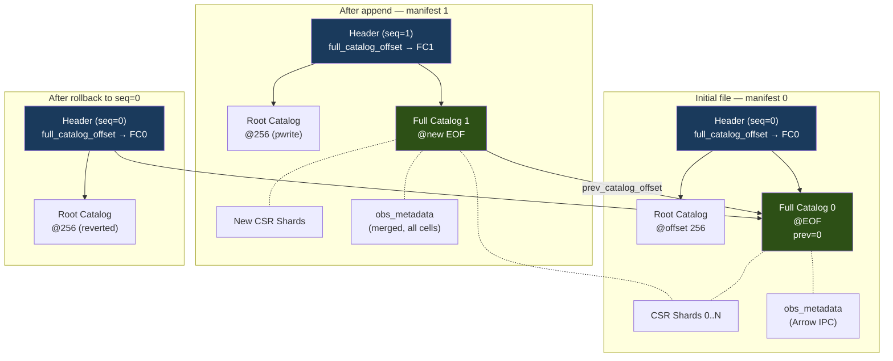

# SCX Binary Format Reference

This is the authoritative reference for the on-disk layout of `.scx` files
(and the equivalent exploded `.scxd/` directories). Bit-level codec details
live in [docs/codec.md](codec.md). Sharding rationale and shard sizing live
in [docs/sharding.md](sharding.md).

**Normative reference**: when this document and the Rust implementation in
`scx-format` / `scx-codec` disagree, the Rust code wins.

**Byte ordering**: all multi-byte integers are **little-endian**. The header
`endian` field exists for validation — readers MUST reject files with
`endian != 0`.

**Alignment**: every section starts at an 8-byte-aligned offset; padding bytes
(zeroed) are inserted between sections as needed.

## 1. Physical Layout

```
experiment.scx (single binary file)
┌──────────────────────────────────────────────────────────────────┐
│ FILE HEADER (256 bytes, offset 0)                                │
├──────────────────────────────────────────────────────────────────┤
│ ROOT CATALOG (offset 256, ≤4096 bytes)                           │
├──────────────────────────────────────────────────────────────────┤
│ FRONT CATALOG (optional, offset ~4352 if has_front_catalog)      │
├──────────────────────────────────────────────────────────────────┤
│ PADDING (to 8-byte alignment)                                    │
├──────────────────────────────────────────────────────────────────┤
│ obs metadata          (Arrow IPC file format)                    │
│ obs predicate indexes                                            │
│ var metadata          (Arrow IPC file format)                    │
│ var predicate indexes                                            │
├──────────────────────────────────────────────────────────────────┤
│ X/csr/000000 … X/csr/{N-1}    (CSR shards)                       │
│ X/csc/…                       (optional, if has_csc)             │
│ X/bitmap/…                    (optional, if has_bitmap)          │
│ layers/{name}/csr/…           (additional CSR shard sets)        │
│ obsm/{name}                   (Arrow IPC dense 2D tensors)       │
│ obsp/{name}/csr/…             (sparse cell-cell graphs)          │
│ uns/metadata.json                                                │
│ provenance                    (structured, §7)                   │
│ deletion_vectors              (optional, §6.3)                   │
├──────────────────────────────────────────────────────────────────┤
│ FULL CATALOG (manifest v0)   (always at EOF of initial file)     │
├──────────────────────────────────────────────────────────────────┤
│ … appended sections + new catalogs (§6.2) …                      │
└──────────────────────────────────────────────────────────────────┘
```

## 2. File Header (256 bytes)

Written LE, at offset 0. Sections up to `reserved` total 144 bytes;
`reserved` pads the rest out to 256.

| Field | Type | Notes |
|-------|------|-------|
| `magic` | `[u8; 4]` | `b"SCX\x01"` |
| `format_version` | `u16` | 1 (legacy), 2 (multimodal-capable), 3 (canonical CSR), or 4 (may contain **row-group-framed** shards — shard v2, multi-entry `BlockIndex`; F5-b). All use the v2 header byte layout; older readers reject newer versions via the version check. **Framing is on by default (F5 Phase C):** the convert / `from_anndata` / `from_h5ad` / `from_10x` / `scx optimize` write paths frame at `DEFAULT_ROW_GROUP_ROWS` (256) and stamp **v4**, so v4 is the common-case output. This is a deliberate pre-1.0 break — a v3-max reader rejects these files. Pass `row_group_rows = 0` (`--row-group-rows 0`) for the legacy unframed **v3** layout when producing files for older readers. The low-level raw `ScxWriter` still defaults to v3 (`DEFAULT_WRITE_FORMAT_VERSION`); the v4 stamp comes from the convert pipeline whenever framing is active. |
| `header_length` | `u16` | 256; reserves space for future header growth |
| `flags` | `u32` | See flag table below |
| `n_obs` | `u64` | Total cells (after deletions) |
| `n_vars` | `u64` | Total genes (file-wide max across modalities on v2) |
| `nnz` | `u64` | Total non-zeros (sums per-modality nnz on v2) |
| `n_csr_shards` | `u32` | |
| `n_csc_shards` | `u32` | 0 if CSC not present |
| `shard_target_rows` | `u32` | Cells per CSR shard; default 16,384 (`DEFAULT_SHARD_TARGET_ROWS`) |
| `codec_id` | `u8` | Default codec (§codec.md). Per-shard override allowed. |
| `index_dtype` | `u8` | 0 = u16 indices, 1 = u32. Set once per file. |
| `endian` | `u8` | 0 = little (required), 1 = big (rejected) |
| `reserved_padding` | `[u8; 1]` | |
| `root_catalog_offset` | `u64` | |
| `root_catalog_length` | `u64` | |
| `full_catalog_offset` | `u64` | Offset of **active** full catalog |
| `full_catalog_length` | `u64` | |
| `manifest_sequence` | `u64` | Monotonic; 0 for initial file |
| `prev_catalog_offset` | `u64` | 0 if first version |
| `file_checksum` | `u64` | BLAKE3 truncated to 64 bits |
| `front_catalog_offset` | `u64` | 0 if `has_front_catalog` unset |
| `front_catalog_length` | `u64` | 0 if not present |
| `n_modalities` | `u32` | v2+ only; number of named modalities (0 = single-modality / v1-shape). Capped at 255. |
| `modality_table_offset` | `u64` | v2+ only; offset of the `ModalityTable` section. 0 when `n_modalities == 0`. |
| `modality_table_length` | `u64` | v2+ only; section byte length. 0 when `n_modalities == 0`. |
| `reserved` | `[u8; 112]` | Zeroed. Shrunk from `[u8; 132]` in v2 to make room for the three modality fields. |

v1 files have the older 132-byte `reserved` field; the v2/v3 reader maps
the leading 20 bytes of that block to the three modality fields
when reading a `format_version = 1` header (validating that those
bytes are zero — v1 writers always zeroed the full reserved block).

v3 does not add header fields. Its breaking change is semantic: newly
written row-major sparse shards are canonical CSR (§4). (v3 historically also
permitted a `decode_metadata_shard` sidecar, section id 26, now removed — see
§4.2.)

### Flags

| Bit | Name | Meaning |
|-----|------|---------|
| 0 | `has_csc` | CSC shards present |
| 1 | `has_bitmap` | Detection bitmap present |
| 2 | `has_obsm` | Cell embeddings present |
| 3 | `has_obsp` | Cell-cell graphs present |
| 4 | reserved | Must be zero on write, ignored on read |
| 5 | `has_deletion_vectors` | Deletion vectors section present |
| 6 | `has_front_catalog` | Cloud-ready layout — front catalog duplicate valid |
| 7 | `has_modalities` | v2 only; set when `n_modalities > 0`. Fast capability check without reading the modality table. |
| 8 | `has_raw` | `adata.raw` count matrix present (`raw_csr_shard` + `raw_var_metadata` sections). |

### Index dtype

`index_dtype=0` (u16) is used when `n_vars <= 65535`, halving index storage.
Files with more features use `index_dtype=1` (u32). All shards in a file
share the same dtype.

## 3. Dual Catalog

The file has **two** catalog structures so that a single contiguous read can
open any `.scx`, while still supporting random access and rollback.

### Root catalog (at offset 256, ≤ 4096 bytes)

A compact summary sufficient for streaming / training readers:

```
n_section_groups: u16
For each group:
  group_type: u8                 (obs_meta, var_meta, csr_shards, csc_shards,
                                   bitmap, layer, obsm, obsp, uns, provenance)
  first_section_offset: u64
  total_group_length: u64
  n_sections: u32
  summary: [u8; 32]              (group-specific — for csr_shards: nnz, value stats)
```

Local opens read `header + root_catalog` (< 4 KB) and can immediately locate
every section group without parsing the full catalog. Cloud range reads do the
same in one GET of the first 4 KB.

### Full catalog (at `full_catalog_offset` — usually EOF)

Complete per-section index. Required for random-access operations and for
rollback (a new catalog is appended per mutation; older catalogs remain in
the file until `scx compact`).

```
catalog_version: u16             (1 = legacy single-modality, 2 = multimodal,
                                  3 = sharded obs / var metadata supported,
                                  4 = CSC-sidecar freshness counters)
manifest_sequence: u64           (matches header)
prev_catalog_offset: u64         (0 if first)
n_obs: u64                       (observable cells after deletions)
n_entries: u32
For each entry:
  name_length: u16
  name_bytes: [u8; name_length]  (UTF-8 path, e.g. "X/csr/000042"
                                  or per-modality "X/{mname}/shard_42")
  offset: u64
  length: u64
  section_type: u8               (enum below)
  checksum: [u8; 32]             (full BLAKE3 of section content)
  modality_id: u8                (v2 only; 0 = global, ≥ 1 = named modality)
  stats_length: u16
  stats: [u8; stats_length]      (per-section stats, format below)
data_generation: u64             (v4 only; CSR-data generation, bumped by append/compact/merge)
csc_build_generation: u64        (v4 only; generation the CSC sidecar was built against)
catalog_checksum: [u8; 32]       (BLAKE3 of all preceding catalog bytes)
```

The `modality_id` field is added between the per-entry checksum and
`stats_length` on v2 catalogs (1 byte / entry; 1 KB extra for a
1000-shard file). v1 catalogs do not carry the field; the v2 reader
materialises every v1 entry with `modality_id = 0` (global) when
opening a v1 file.

v4 appends two `u64` generation counters (`data_generation`,
`csc_build_generation`) between the entry list and the catalog checksum.
The append is additive and inside the checksummed payload, so older
readers parse the entries, ignore the trailing 16 bytes, and the checksum
still validates. The bytes are emitted only when a counter is non-zero, so
legacy / zero-counter files stay byte-identical at their v2/v3 declared
version. The counters are a CSC-sidecar freshness guard: CSR-mutating
writers bump `data_generation`, and only a CSC (re)build advances
`csc_build_generation` to match. A sidecar is fresh iff
`csc_build_generation == data_generation`; a reader rejects a present
sidecar whose counters disagree (v1–v3 files default both to `0`, so
`0 == 0` reads as fresh and legacy sidecars are never rejected).

### `section_type` enum

| ID | Type |
|----|------|
| 0 | `obs_metadata` |
| 1 | `obs_index` |
| 2 | `var_metadata` |
| 3 | `var_index` |
| 4 | `csr_shard` |
| 5 | `csc_shard` |
| 6 | `bitmap_shard` |
| 7 | `layer_csr_shard` |
| 8 | `obsm_embedding` |
| 9 | `obsp_csr_shard` |
| 10 | `uns_blob` |
| 11 | `provenance` |
| 12 | `deletion_vectors` |
| 13 | `obs_predicate_index` |
| 14 | `var_predicate_index` |
| 15 | `modality_table` (v2; ordered list of modality records — see § 13) |
| 16 | `layer_csc_shard` (v2; per-modality CSC sidecar for a named layer) |
| 17 | `varm_embedding` (Arrow IPC; dense `n_vars × n_components` embedding — mirror of `obsm_embedding`) |
| 18 | `obsp_embedding` (Arrow IPC; COO sparse `n_obs × n_obs` pairwise matrix — see § COO wire format below) |
| 19 | `varp_embedding` (Arrow IPC; COO sparse `n_vars × n_vars` pairwise matrix — same wire format as `obsp_embedding`) |
| 20 | `obsm_embedding_shard` (Arrow IPC; row-shard of an `obsm/<name>` dense embedding — see § Sharded obsm/varm/obsp/varp below) |
| 21 | `varm_embedding_shard` (Arrow IPC; row-shard of a `varm/<name>` dense embedding) |
| 22 | `obsp_embedding_shard` (Arrow IPC COO; row-shard of an `obsp/<name>` pairwise sparse matrix) |
| 23 | `varp_embedding_shard` (Arrow IPC COO; row-shard of a `varp/<name>` pairwise sparse matrix) |
| 24 | `obs_metadata_shard` (Arrow IPC; row-shard of the obs metadata batch — see § Sharded metadata layout below) |
| 25 | `var_metadata_shard` (Arrow IPC; row-shard of the var metadata batch — mirror of `obs_metadata_shard`) |
| 26 | Reserved (formerly `decode_metadata_shard`, the removed Scx1 decode sidecar — see §4.2; legacy files carrying it are skipped and full-decode) |
| 27 | `raw_csr_shard` (row-shard of the `adata.raw` count matrix — same obs axis as `csr_shard` but its OWN, typically wider, var axis; signalled by the `has_raw` flag) |
| 28 | `raw_var_metadata` (Arrow IPC; the `adata.raw.var` DataFrame, companion to `raw_csr_shard`) |
| 29 | `group_index` (JSON; condition/label-grouped sharding sidecar — `{group_by, reference_shard, reference_labels, records[]}`, records `{label, shard, row_start, row_stop, role}` with **global** output-row indices; written by `scx sort --group-by`, consumed by the grouped-read API) |
| 30–31 | Reserved for multimodal/spatial extensions |
| 32–239 | Reserved for future use |
| 240–254 | Reserved for vendor / encrypted / private section types |
| 255 | Sentinel |

Unknown types are skipped by readers with a warning, which allows the
format to evolve without breaking old readers.

#### `adata.raw` (raw section family)

`adata.raw` holds pre-normalization counts on its **own var axis** (usually more
genes than `X`, because `.raw` is captured before HVG subsetting), so it cannot be
stored as a layer (layers share `X`'s `n_vars`). It is written as a dedicated
family: `raw_csr_shard` sections (`raw/X_shard_<idx>`, row-major CSR sharing `X`'s
obs axis, with per-shard `index_dtype` resolved against the raw var count — a raw
matrix with > 65535 genes uses u32 column indices even when `X` uses u16) plus a
single `raw_var_metadata` section (`raw/var`). Presence is signalled by the
`has_raw` header flag (bit 8). Adding the flag does not bump `format_version`
(stays 3), but a raw-containing file is only readable by readers that recognise
bit 8 — older readers reject the unknown flag bit (pre-1.0; not a frozen format).

#### `uns_blob` (nesting depth)

The `uns_blob` section is a UTF-8 JSON document. Container nesting inside it is
bounded, and a conforming writer MUST NOT exceed **60 levels** — counting
dicts, lists and tuples from the `uns` root, where a tagged envelope
(`{"__scx_type__": "tuple", "data": [...]}`) is one level even though it
occupies two in the JSON.

The bound is not decorative. Every producer and consumer of this section walks
it recursively, so an unbounded tree exhausts the stack and aborts the process
instead of raising. Independently, the reference JSON parser stops at **127**
nesting levels while its serializer has no limit at all — so an uncapped writer
can emit a section that no reader can take back. 60 containers is the deepest
tree that still fits under 127 in the worst case, where every container is a
two-level tagged tuple.

Readers SHOULD accept up to 127 levels rather than 60, so that a file written
before this bound existed still opens if it is parseable at all.

### Per-shard statistics

Present when `section_type ∈ {csr_shard, csc_shard, layer_csr_shard, obsp_csr_shard}`:

```
row_start: u64                   (first row, global)
row_end:   u64                   (exclusive end, global)
nnz:       u64
value_min: u32                   (integer encodings only)
value_max: u32
value_sum: u64
n_indexed_columns: u8
For each indexed column:
  column_name_hash: u64          (BLAKE3 truncated)
  stat_type: u8                  (0 = numeric min/max, 1 = category bitset)
  If numeric:
    col_min: f64
    col_max: f64
  If categorical:
    bitset_length: u16
    category_bitset: [u8]        (bit i set if dictionary index i present)
```

`value_min` / `value_max` / `value_sum` are meaningful **only** for integer
value encodings (uint8/16/32). For float encodings (f32, f16) they are zero
and MUST NOT be used for pushdown filtering.

These statistics power catalog-level predicate pushdown — the query engine
can skip entire shards without reading any section data. Selective `pull`
(see [docs/cloud.md]) uses the same mechanism.

## 4. CSR Shard Internal Layout

Each CSR shard is a **self-contained**, contiguous section. It can be read,
validated, and decoded in isolation — which is what enables parallel shard
decode, exploded `.scxd` layouts, and selective pull.

```
┌──────────────────────────────────────────────────────────────┐
│ SHARD HEADER (76 bytes)                                      │
├──────────────────────────────────────────────────────────────┤
│ INDPTR SECTION     (encoded per shard's codec_id)            │
│ INDICES SECTION                                              │
│ VALUES SECTION                                               │
│ BLOCK INDEX        (for O(1) random row access)              │
└──────────────────────────────────────────────────────────────┘
```

### Shard header (76 bytes)

| Field | Type | Notes |
|-------|------|-------|
| `magic` | `[u8; 4]` | `b"SCXS"` |
| `shard_format_version` | `u8` | 1 = whole-shard (single/oversized-split `BlockIndex`, zero offsets); 2 = **row-group-framed** (multi-entry `BlockIndex` with real per-group byte offsets). |
| `shard_type` | `u8` | 0 = CSR, 1 = CSC |
| `codec_id` | `u8` | May override file header |
| `value_encoding` | `u8` | May override file header |
| `index_dtype` | `u8` | 0 = u16, 1 = u32 |
| `reserved_flags` | `[u8; 3]` | |
| `n_major` | `u32` | Rows in this shard (CSR) |
| `n_minor` | `u32` | Columns in full matrix |
| `nnz` | `u64` | |
| `global_offset` | `u64` | First row index in full matrix |
| `indptr_rel_offset` | `u32` | Relative to shard start |
| `indptr_length` | `u32` | |
| `indices_rel_offset` | `u32` | |
| `indices_length` | `u32` | |
| `values_rel_offset` | `u32` | |
| `values_length` | `u32` | |
| `block_index_rel_offset` | `u32` | |
| `block_index_length` | `u32` | |
| `checksum` | `[u8; 8]` | BLAKE3 truncated to 64 bits, covers everything after the header |

Total: 76 bytes. Implementations MUST use exactly 76 — this matches
`SHARD_HEADER_SIZE` in `scx-format/src/shard.rs`.

> **Per-shard codec override**: readers MUST use the shard header's
> `codec_id` and `value_encoding`, not the file header's. The file header
> values are a hint for tools that want summary stats without touching
> individual shards. This is how a file can mix, e.g., Scx1 raw integer
> shards in `X` with Zstd-compressed float shards in a normalized layer.

### v3 canonical CSR invariant

For `format_version >= 3`, newly written row-major sparse shard sections
(`csr_shard`, `layer_csr_shard`, and `obsp_csr_shard`) MUST be canonical CSR:

- `indptr[0] == 0`, `indptr` is monotonic, and `indptr.last() == nnz`.
- Every row stores column indices in strictly increasing order.
- Every stored index is in `[0, n_minor)`.
- Duplicate `(row, col)` coordinates are summed before write.
- Explicit zero values are dropped after duplicate summation.

This invariant is enforced by current writers at untrusted ingest boundaries
(h5ad/h5mu/10x/MTX and Python AnnData inputs). Readers do not need to
canonicalize on ordinary reads; use `scx validate --deep` to decode shards
and check the invariant.

### Block index

Enables O(1) random access to any row range inside a shard:

```
n_blocks: u32
For each block:
  row_start: u32                 (first row in block, global index)
  n_rows: u16
  indptr_byte_offset: u32        (within indptr section)
  indices_byte_offset: u32
  values_byte_offset: u32
  nnz_in_block: u32
```

`row_start: u32` here is correct because it addresses rows within a shard
(max `shard_target_rows`, typically 16,384). The *full* catalog's shard
statistics use `u64` because they address global rows (billions of cells).

**Two layouts (per `shard_format_version`):**

- **v1 (unframed):** one whole-shard entry (or a `≤MAX_BLOCK_ROWS` split for
  oversized grouped shards) with `*_byte_offset = 0`. The three sub-streams are
  monolithic; the offsets are reserved and unread — decode is whole-shard.
- **v2 (row-group-framed, F5-b):** one entry per row-group with **real** per
  sub-stream byte offsets. Each group is a standalone encoded sub-shard: its
  `indptr` is group-local-rebased (`indptr[0] == 0`, `indptr.last() ==
  nnz_in_block`), and its indices/values are that group's frame. A group's byte
  range in each sub-stream is `[offset[g], offset[g+1])` (last group ends at the
  sub-stream length). `resolve_block_index` (`scx-format/src/shard.rs`) validates
  the whole index (sorted, contiguous, coverage `== n_major`, monotonic in-bounds
  offsets, `nnz_in_block <= n_rows * header.n_minor`, `Σ nnz_in_block ==
  header.nnz`) and resolves each entry to a byte-range span;
  `scx_codec::decode_row_group` decodes one group codec-agnostically. This
  is what gives every codec (not just Scx1) O(touched-rows) random access. Applies
  to CSR/layer/obsp and CSC sidecar shards (row-group ≡ gene-group for CSC).

  The group-capacity rule (`nnz_in_block <= n_rows * n_minor`) follows from the
  [v3 canonical CSR invariant](#v3-canonical-csr-invariant): indices are strictly
  increasing within a row and every index lies in `[0, n_minor)`, so a group
  cannot store more entries than it has cells. Framing exists only in v4 files
  and v4 ⊇ v3, so it holds for every framed shard.

**Reader requirement — reassembly must not pre-allocate from the header.**
`header.nnz`, `header.n_major` and every `nnz_in_block` are unauthenticated (the
catalog's BLAKE3 covers catalog bytes, not shard payloads), so a conforming
reader must not size its reassembly buffers directly from them: a single-entry
index declaring `nnz_in_block = u32::MAX` passes every check above and would
otherwise demand tens of GB from a ~100-byte file. Note that no bound can be
*validated* here — the elements-per-encoded-byte ratio has no codec-agnostic
floor (the 8:1 figure that holds for Scx1 is the information-theoretic floor of
Rice/Golomb coding and does not apply to the zstd-family codecs), so the ratio
must clamp the reservation rather than reject the shard. `scx-format`'s
`clamped_reserve` does this; correctness rests on each group's decode
length-checking its own frames before anything is appended.

### Shard sizing defaults

Default 16,384 cells per CSR shard (`DEFAULT_SHARD_TARGET_ROWS`). At 5% density × 30K
genes → ~24M non-zeros per shard → ~50–100 MB compressed. Rationale and tradeoffs are in
[docs/sharding.md](sharding.md).

## 4.1 CSC Shard Internal Layout

CSC sidecar shards are an **optional column-major view** of the same
data the CSR shards hold. They are emitted by `scx convert
--csc=always`, `pyscx.from_anndata(csc="always")`, `scx build-csc`,
and the `--rebuild-csc` flag on the mutating ops (`append`, `compact`,
`merge`, `subset`).

A CSC shard has the **same on-disk structure** as a CSR shard — same
76-byte shard header, same encoded `indptr` / `indices` / `values`
sections, same block index. The column-major semantics live in the
field interpretation:

| Field | CSR semantics | CSC semantics |
|-------|---------------|---------------|
| `shard_type` | `0` (legacy: also produced for CSC) | `1` (authoritative) — readers also accept `0` when the catalog `section_type` is `CscShard` (legacy compatibility) |
| `n_major` | rows in this shard | **columns** in this shard |
| `n_minor` | columns in full matrix | **rows** in full matrix (`n_obs`) |
| `global_offset` | first row index | first **column** index covered by this shard |
| `indptr` (length `n_major + 1`) | row-pointer | **column-pointer** |
| `indices` (length `nnz`) | column indices in full matrix | **global row** indices in full matrix (CSC indices are NOT shard-local — they reference rows across all shards) |

Catalog `section_type = CscShard (5)` is the authoritative
discriminator; the in-shard `shard_type` byte exists for self-contained
shard validation (e.g. exploded `.scxd` files where the catalog and
shard live in separate files). Going forward writers emit `shard_type
= 1`; readers also accept `shard_type = 0` for files written before
the `derive_shard_type()` fix landed.

### `ShardStats.row_start` / `row_end` axis overload

CSC shards reuse the catalog `ShardStats.row_start` / `row_end` fields
to record the **major-axis** range, which for CSC means
`col_start..col_end`. The on-disk schema is unchanged from the CSR-only
era; only the field interpretation differs.

Code accessing these fields should pick by section type:

| Method | When to use |
|--------|-------------|
| `ShardStats::major_start()` / `major_end()` | Generic — works for any shard type, returns the row range for CSR/Layer/Obsp and the col range for CSC. Use when the section type is unknown or when writing axis-agnostic helpers. |
| `ShardStats::row_range()` | When the entry is known to be a row-major shard (`CsrShard`, `LayerCsrShard`, `ObspCsrShard`). |
| `ShardStats::col_range()` | When the entry is known to be `CscShard`. |
| Direct `ShardStats.row_start` field access | Allowed in legacy code paths but discouraged — prefer the accessors above. |

A future format-version bump may rename the underlying fields (e.g. to
`major_start` / `major_end`) without breaking on-disk compatibility,
since the byte layout is unchanged. Until then the overload is
documented but the schema stays put.

### Multi-shard CSC layout

A CSC sidecar may be split into multiple shards by column range
(controlled by `--csc-cols-per-shard`, default 5000). Each shard
covers a contiguous half-open `[col_start, col_end)` range; ranges are
non-overlapping and sorted by `col_start`. The catalog's
`csc_shards_sorted()` accessor returns the shards in column order.

Column-range pushdown: `BackedCscReader::read_csc_columns(c_lo..c_hi)`
uses `BackedCscIndex::shards_for_col_range(c_lo, c_hi)` to skip
non-overlapping shards entirely; partial-overlap shards are sliced
post-decode. See `docs/sharding.md` § CSC sharding.

### `scx upgrade` preserves CSC

`scx upgrade` re-emits the file through the current writer
while preserving CSC sidecars: the CSR rewrite loop calls
`writer.write_csr_shard()`, then the CSC entries are walked via
`catalog.csc_shards_sorted()` and re-emitted via
`writer.write_csc_shard()` on the new file. The post-upgrade file has
identical CSC content (byte-equal under the same codec) and a
correctly populated `n_csc_shards` count + `has_csc` flag.

## 4.2 Decode Metadata Sidecar (removed — section id 26 reserved)

The **decode metadata sidecar** (`decode_metadata_shard`, section type 26) was a
per-row / per-Rice-block index that gave the Scx1 codec bit-level random access
and fed the GPU decode handoff. It has been **removed**: row-group framing (the
`BlockIndex`, `format_version` 4 / `shard_format_version` 2 — see [§ 4 CSR Shard
Internal Layout](#4-csr-shard-internal-layout) and [codec.md § Row-group framing](codec.md#row-group-framing-v4-file--shard-v2--random-access-safe)) is now
the default write layout and provides codec-agnostic sub-shard random access for
*all* codecs, and framed Scx1 shards decode group-by-group in VRAM directly — so
the sidecar became pure redundancy.

Writers no longer emit section 26, and **id 26 is reserved**. Legacy files that
carry a section-26 sidecar remain readable: the catalog reader skips the
unrecognized section, and CSR decode never consulted it (a full-shard decode is
self-describing), so those files open and decode byte-identically. Sub-shard
random access on such a legacy file uses the block index when present, else a
full-shard decode.

## 5. Arrow IPC Metadata

`obs` and `var` metadata are stored as **Arrow IPC file format** (not the
streaming variant) — the file includes a footer with schema and record batch
offsets, so readers can seek to individual columns without reading the whole
section.

- **Nullable columns**: standard Arrow validity bitmaps.
- **Categorical columns**: Arrow dictionary encoding. Predicate indexes (§6)
  are built on the dictionary values, not encoded indices. Arrow's
  `DictionaryArray` carries no `ordered` bit, so the pandas/anndata `ordered`
  flag is preserved out-of-band in **Arrow `Field` metadata** under the key
  `scx.categorical.ordered` (`"true"` / `"false"`). Arrow IPC round-trips field
  metadata, so the bit survives the obs/var section without a format-version
  change; the h5ad reader stamps it from the source `ordered` attribute and the
  h5ad writer re-emits it.
- **Chunking**: for datasets > 10M cells, `obs` is split into multiple record
  batches (one per CSR shard group) inside a single IPC file. Readers can
  lazy-load metadata for just the shards they touch.
- **Zero-copy**: Arrow IPC is memory-mappable. Python exposes Arrow arrays via
  PyArrow — zero-copy for primitive and dictionary types; string columns
  allocate Python heap strings (use categoricals to avoid this).

### Embedding & pairwise sections (`obsm`, `varm`, `obsp`, `varp`)

- **`obsm_embedding` (8) / `varm_embedding` (17)** — Arrow IPC RecordBatch of a
  dense matrix. `obsm` is `n_obs × n_components`; `varm` is `n_vars × n_components`.
  Each component is a column. Stored as float32 by convention.
- **`obsp_embedding` (18) / `varp_embedding` (19)** — Arrow IPC RecordBatch
  representing a sparse matrix in COO form. The batch has three columns
  (`row`, `col`, `data: Float32`, length `nnz`) plus schema-level metadata
  (`n_rows`, `n_cols`) recording the logical shape. The row/col coordinate
  width is carried by the Arrow IPC schema itself — no extra section-header
  byte — and is chosen by the routing oracle `coo_needs_int64_coords(n_rows,
  n_cols)`:
  - **v1 layout (`Int32` row/col)** when both axes ≤ `i32::MAX`. This is the
    byte-identical layout used for every workload below sub-`2³¹` axes.
  - **v2 layout (`Int64` row/col)** when either axis exceeds `i32::MAX`.
    Same Arrow schema shape, wider coordinate columns.

  pyscx readers reconstruct a scipy CSR via
  `scipy.sparse.csr_matrix((data, (row, col)), shape=(n_rows, n_cols))`
  for either width. Data is stored as float32; higher-precision inputs are
  downcast on write. The on-disk section always retains the original axis
  lengths. When a deletion vector (or backed-mode `obs_filter`) is active,
  pyscx subsets `obsp` to the kept rows and columns at read time so the
  materialized AnnData satisfies `obsp[k].shape == (n_obs, n_obs)`. `varp`
  lives on the var axis and is not affected by deletion vectors.

#### Sharded layout (section types 20–23)

Files written by pyscx 0.5+ and the `scx-convert` streaming pipeline
shard the `obsm` / `varm` / `obsp` / `varp` sections into row-aligned
chunks so the converter and the consumer can bound peak RSS at one
`shard_target_rows`-worth of rows per matrix, regardless of total
`n_obs` / `n_vars` or per-key `k`. The shape on disk is:

- **`obsm_embedding_shard` (20)** — name `obsm/<key>_shard_<idx>`. Arrow
  IPC of a dense `(n_local_rows × n_components)` `RecordBatch` covering
  rows `[row_start, row_start + n_local_rows)` of the logical matrix.
  Schema metadata: `row_start: u64`, `shard_idx: u32`,
  `n_rows_total: u64`.
- **`varm_embedding_shard` (21)** — symmetric, on the var axis.
- **`obsp_embedding_shard` (22)** — name `obsp/<key>_shard_<idx>`. Arrow
  IPC COO `RecordBatch` (`row`, `col`, `data: Float32`) containing the
  non-zero triples whose `row` is in
  `[row_start, row_start + n_local_rows)`. Row/col width follows the same
  `Int32` (v1) / `Int64` (v2) routing as the unsharded `obsp_embedding`
  layout above; the Arrow schema is the width signal. Schema metadata
  carries `n_rows` / `n_cols` (logical matrix shape) plus `row_start` /
  `shard_idx` / `n_rows_total`. `row` values are global indices.
- **`varp_embedding_shard` (23)** — symmetric, on the var axis.

`ScxReader::read_obsm` and the obsm/varm/obsp/varp friends transparently
scan the catalog for sharded entries, sort by `shard_idx`, and
concatenate via `arrow::compute::concat_batches`. Legacy single-section
files (types 8 / 17 / 18 / 19) keep reading via the fall-through path
in the same accessor — no migration required.

#### Sharded metadata layout (section types 24–25)

Files written by streaming `scx merge`, `scx append`, and pyscx 0.5+
`from_anndata` (when `n_obs > shard_target_rows`) shard the obs/var
metadata batches the same way obsm/varm/obsp/varp are sharded above.
This bounds peak memory at one shard's worth of metadata during the
merge/append/ingest hot path and — critically — keeps each shard
below Arrow IPC's 2 GB narrow-offset ceiling for string columns,
which the legacy single-section `obs_metadata` / `var_metadata`
layout could overflow on atlas-scale obs string payloads.

- **`obs_metadata_shard` (24)** — name `obs_metadata/shard_<idx>`. Arrow
  IPC of one `RecordBatch` covering obs rows
  `[row_start, row_start + n_shard_rows)` of the logical obs table.
  Same Arrow schema as the legacy single-section `obs_metadata` —
  string columns are upcast to `LargeUtf8` on write so per-shard
  offsets stay in range regardless of cumulative payload. Schema
  metadata: `shard_idx: u32`, `row_start: u64`, `n_shard_rows: u32`,
  `n_rows_total: u64`.
- **`var_metadata_shard` (25)** — symmetric, on the var axis. Name
  `var_metadata/shard_<idx>`.

A file MUST NOT carry both `obs_metadata` (type 0) and
`obs_metadata_shard` (type 24); the writer enforces this and reports
`ScxError::ObsLayoutConflict` if a caller mixes the APIs (same rule
for the var axis). Legacy single-section `obs_metadata` /
`var_metadata` files remain fully readable — `ScxReader::read_obs` /
`read_var` transparently assemble shards on demand for either layout,
and `scx append` on a legacy file promotes the obs to a single
`obs_metadata_shard` (shard 0) on the first growth.

## 6. Predicate Indexes

Sorted mappings from column values to shard-local row ranges, attached to
`obs_metadata` and `var_metadata`.

Two layouts coexist: **v1** (narrow counters) is byte-identical for every
workload below the v1 ceilings; **v2** (wide counters) widens the on-disk
counters that v1 stored as `u16` / `u32` to `u32` / `u64` so extreme-cardinality
columns or multi-billion-row obs axes can be represented without silent
truncation. Writers auto-select via a pre-scan: v1 when every counter fits its
v1 width, v2 otherwise. Readers dispatch on the leading `index_version` byte;
an unknown version returns `InvalidData`.

```
PREDICATE INDEX SECTION (v1 — narrow counters):
  index_version: u8              (1)
  n_indexed_columns: u16
  For each column:
    column_name_length: u16
    column_name: [u8]            (UTF-8)
    column_type: u8              (0 = categorical, 1 = numeric)
    n_entries: u32

    If categorical:
      For each unique value (lexicographic):
        value_length: u16
        value_bytes: [u8]        (UTF-8 category label)
        n_shard_ranges: u16
        For each range:
          shard_id: u32
          row_start: u32         (shard-local)
          row_end: u32

    If numeric:
      fanout: u16                (B+ tree branching factor, typically 64)
      n_leaf_pages: u32
      n_internal_pages: u32
      For each internal page:
        n_keys: u16
        keys: [f64; n_keys]
        children: [u32; n_keys + 1]
      For each leaf page:
        n_entries: u32
        For each entry:
          min_value: f64
          max_value: f64
          shard_id: u32
          row_start: u32
          row_end: u32
```

```
PREDICATE INDEX SECTION (v2 — wide counters):
  index_version: u8              (2)
  n_indexed_columns: u32         (was u16 in v1)
  For each column:
    column_name_length: u32      (was u16)
    column_name: [u8]            (UTF-8)
    column_type: u8              (0 = categorical, 1 = numeric)
    n_entries: u64               (was u32)

    If categorical:
      For each unique value (lexicographic):
        value_length: u32        (was u16)
        value_bytes: [u8]        (UTF-8 category label)
        n_shard_ranges: u32      (was u16)
        For each range: shard_id / row_start / row_end (u32 each, unchanged)

    If numeric:
      fanout: u16                (unchanged)
      n_leaf_pages: u64          (was u32)
      n_internal_pages: u64      (was u32)
      For each internal page:
        n_keys: u16, keys: [f64; n_keys], children: [u32; n_keys + 1]   (all unchanged)
      For each leaf page:
        n_entries: u64           (was u32)
        For each entry: min_value / max_value (f64), shard_id / row_start / row_end (u32 each, unchanged)
```

**High-cardinality columns** (> 10,000 unique values, e.g. `donor_id`): the
categorical index becomes a minimal perfect hash function pointing to offset
arrays, capping size at ~100 KB regardless of cardinality.

**Unindexed columns**: writers only index columns marked `indexed=True` or
those with < 1000 unique values. The reader falls back to sequential scan for
unindexed columns.

## 7. Fragment / Manifest Model

SCX uses a **fragment/manifest architecture** inspired by Lance and Delta Lake.
Shards and other sections are **immutable fragments** — once written, their
bytes never change. The full catalog is a **manifest** that names the
currently-active fragments. This is what makes appends, deletions, and
rollback safe in a single file.

The following diagram shows how catalogs chain across mutations:



### 7.1 Initial file creation (atomic rename)

1. Writer creates a temp file (`experiment.scx.tmp.{pid}`).
2. Sections are written sequentially starting at offset 4352 (256 header + 4096
   root catalog placeholder).
3. Full catalog (manifest 0) is appended.
4. Root catalog is written at offset 256 via `pwrite()` (offsets are now known).
5. Header is written at offset 0 via `pwrite()` — `manifest_sequence=0`,
   `prev_catalog_offset=0`.
6. `fsync()` the temp file.
7. `rename()` to final path (atomic on POSIX).

If the process is killed before step 7, the temp file is an orphan that can be
deleted. The final path either exists complete or doesn't exist at all.

### 7.2 Append

Adding cells, layers, or embeddings does NOT rewrite existing bytes:

1. Open for append (`O_WRONLY | O_APPEND`).
2. Acquire advisory `flock()` (prevents concurrent appends).
3. Seek to EOF.
4. Write new sections sequentially (new CSR shards, updated `obs_metadata`, …).
5. Write a new full catalog that references **both** original and new sections.
   Set `prev_catalog_offset` to the old catalog offset.
6. `pwrite()` the root catalog at offset 256.
7. `pwrite()` the header at offset 0: bump `manifest_sequence`, update
   `full_catalog_offset/length`, update `n_obs` / `nnz` / `n_csr_shards`.
8. `fsync()`.
9. Release the lock.

**Commit point**: step 7 — the single header `pwrite()`. Until then, readers
see the previous manifest. A crash between steps 4 and 6 leaves trailing
garbage past the last valid catalog, which is harmless: the reader locates the
active catalog via the header, never by scanning.

**Metadata invariant**: when new cells are appended, a fresh `obs_metadata`
section covering *all* cells is written. The new catalog points to it; the
old `obs_metadata` section remains in the file but is orphaned until `scx
compact` reclaims its space. `var_metadata` is unchanged (append is cell-axis
only).

### 7.3 Deletion vectors (logical delete)

Filters that want to mark cells as deleted without rewriting shards append a
deletion vectors section + a new catalog. The section is keyed by
`modality_id` and stores **global obs row indices** (`DV_VERSION = 2`):

```
DELETION VECTORS SECTION:
  dv_version: u8                 (2)
  n_entries:  u32                (number of (modality_id, bitmap) groups)
  For each entry:
    modality_id: u8              (0 = global / all modalities; ≥1 = scoped
                                   to that modality — reserved, see below)
    reserved:    [u8; 3]         (zeroed; alignment + future flags)
    bitmap_length: u32
    bitmap:      [u8]            (Roaring Bitmap of GLOBAL obs row indices)
```

Because every modality independently tiles the shared global obs axis
`[0, n_obs)`, a global bitmap (`modality_id = 0`) applies identically to any
modality's shards — the read keep-mask is
`keep[r] = !(global(0).contains(r) || scoped(m).contains(r))`. Shipped writers
only ever populate `modality_id = 0` (whole-cell delete); `modality_id ≥ 1`
scopes a deletion to a single modality and is reserved wire-format headroom for
a future "drop one modality's measurement" capability (not emitted today).
`total_deleted()` — the logical `n_obs = physical − deleted` — counts only the
global bitmap.

**v1 back-compat.** `DV_VERSION 1` (per-shard bitmaps of shard-local row indices,
keyed by positional CSR-shard id) is still read: the reader parses the v1 shards
and immediately folds them to a global bitmap
(`global_row = csr_shards_sorted()[shard_id].row_start + local_row`) stored under
`modality_id = 0`. For single-modality files — the only ones with trustworthy v1
deletion vectors — this is exact. Writers always emit v2.

When `has_deletion_vectors` is set, readers apply the bitmap during shard
decode — deleted rows are skipped. `scx rollback` undoes a logical delete
because the shard data was never modified.

### 7.4 Compaction

After many appends and deletions, `scx compact`:

- Drops orphaned sections (referenced only by old catalogs)
- Physically removes rows marked by deletion vectors
- Merges small shards into full-sized ones (target: `shard_target_rows`)
- Writes a clean single-manifest file via the standard atomic rename path.
  The output has `manifest_sequence=0` and no previous catalogs.

### 7.5 Rollback

Previous catalogs are preserved, so `scx rollback` is a single header
`pwrite()` that points `full_catalog_offset` and `manifest_sequence` back to
a prior version. `scx rollback --to-seq N` rolls back to a specific sequence.
No data is deleted. To permanently discard old versions, follow up with
`scx compact`.

## 8. Provenance

```
PROVENANCE SECTION:
  provenance_version: u8         (1)
  n_operations: u32
  For each operation:
    timestamp: i64               (Unix epoch seconds)
    action_length: u16
    action: [u8]                 (UTF-8: "create", "convert", "merge", "append",
                                    "delete", "compact", "rollback",
                                    "add_layer", "add_csc", "add_obsm", …)
    tool_length: u16
    tool: [u8]                   (UTF-8: "scx 0.4.0", "pyscx 0.4.0", …)
    params_json_length: u32
    params_json: [u8]            (UTF-8 JSON, tool-specific)
    input_checksums_count: u8
    For each input:
      checksum: [u8; 32]         (BLAKE3 of input file)
```

`scx merge` preserves provenance chains from every input, then appends its
own operation entry, giving end-to-end lineage.

## 9. Checksums

All checksums use **BLAKE3** (>5 GB/s on modern CPUs, cryptographically
secure, faster than xxHash on long inputs).

| Scope | Hash | Where |
|-------|------|-------|
| Per-section | 32-byte BLAKE3 | full catalog entry |
| Per-shard | 64-bit truncated BLAKE3 | shard header; covers everything after the header |
| Catalog | 32-byte BLAKE3 | last 32 bytes of full catalog; covers all preceding catalog bytes |
| File | 64-bit truncated BLAKE3 | file header `file_checksum` |

On checksum failure, the reader names the specific corrupted section. Non-
essential sections (layers, embeddings, obsp graphs) may be skipped with a
warning; corruption in `obs_metadata`, `var_metadata`, or a CSR shard in `X`
is a hard error.

### 9.1 Verification levels

SCX separates **catalog verification** (fast, always-on) from **payload
verification** (expensive, opt-in):

| Level | API | What is checked | Cost |
|-------|-----|-----------------|------|
| **Catalog verification** | `ScxReader::open()` / `pyscx.open()` | Header magic, format version, catalog structure (offsets, lengths). The catalog checksum (last 32 bytes) authenticates all catalog entries — a bit-flip in any stored per-section checksum is detected here. | O(catalog size) — sub-millisecond for typical files. |
| **Payload verification** | `pyscx.validate(path)` / `scx validate path` | Re-hashes every section's raw bytes against the 32-byte BLAKE3 stored in the catalog. Also verifies the header `file_checksum` and every per-shard truncated-64 checksum. | O(file size) — full sequential read. |

`pyscx.open(path)` does **not** re-hash individual section payloads; it trusts
the catalog's stored checksums once the catalog itself is authenticated.
Payload corruption (e.g., a bit-flip in a CSR shard) is detected only when
that section is read and decoded (the shard header's truncated-64 checksum
catches it), or proactively via `pyscx.validate()`.

### 9.2 File checksum semantics

The header field `file_checksum` is a **BLAKE3 hash truncated to 64 bits**
computed over the entire active file extent. Concretely, the writer feeds the
hasher (in order):

1. The 256-byte header, serialised with the `file_checksum` field (bytes
   100..108) set to zero.
2. The root catalog at offset 256, padded with zeros to 4096 bytes (so bytes
   `256 + root_catalog_length` through 4351 are zero in the hash, matching the
   zero-padding on disk).
3. All section bytes from offset 4352 (`SECTIONS_START_OFFSET`) up to
   `full_catalog_offset`.
4. The full catalog (length = `full_catalog_length`).

The result is a fast, single-number integrity signal for the entire file
extent. Bytes past `full_catalog_offset + full_catalog_length` (e.g. trailing
garbage from a crashed append) are not covered.

| Event | `file_checksum` behaviour |
|-------|--------------------------|
| Initial write | Set during the final header `pwrite()` (step 5 of §7.1). |
| After `append` | Updated to cover the new file extent (new sections + new catalog). |
| After `rollback` | Recomputed over the rolled-back extent (header through the reverted catalog). |
| Trailing garbage after crash | Irrelevant — `file_checksum` covers only bytes up to `full_catalog_offset + full_catalog_length`; bytes beyond are ignored by readers and excluded from the hash. |

**Relationship to per-section checksums**: `file_checksum` and per-section BLAKE3
checksums are independent. A valid `file_checksum` with a corrupt per-section
checksum (or vice versa) is possible after partial disk corruption — `validate()`
checks both independently.

**Encryption**: not in v1. Section types 240–254 are reserved for future
encrypted section types. For PHI datasets, use filesystem-level encryption
(LUKS, dm-crypt, GCS CMEK).

## 10. Versioning & Compatibility

- **`format_version`** — bump for breaking changes. Readers MUST reject files
  with `format_version` higher than their supported maximum.
- **Unknown section types** (≥30 for the current format; id 26 is also reserved)
  are skipped with a warning, enabling incremental extension without breaking old
  readers.
- **`header_length`** reserves space for future header growth — older readers
  that only handle 256-byte headers detect a larger `header_length` and exit
  gracefully.
- **Migration**: `scx upgrade input.scx output.scx` rewrites a file to the
  latest format version.

## 11. Concurrent Read Safety

Because sections are immutable fragments, **concurrent reads are always safe**
regardless of concurrent appends:

- New sections are written past the range any current reader is touching.
- The catalog switch is a single 256-byte header `pwrite()` — atomic on POSIX.
- A reader that opened before the switch sees the old manifest; a reader that
  opens after sees the new one. There is no partially-updated state.

**Advisory locking** (`flock()`) prevents concurrent *appends* (two writers).
It is not needed for readers. See [docs/multithreading.md §Concurrent file
access](multithreading.md#concurrent-file-access) for the full picture,
including graceful `flock()` fallback on NFS/Lustre/GPFS.

**mmap on network filesystems**:

- GPFS: mmap works; readahead may be suboptimal for shard-level random access.
  Explicit `madvise(MADV_SEQUENTIAL)` per shard group helps.
- NFS: known mmap cache-coherency issues if the file is appended while mapped.
  SCX is safe in practice because sections are immutable and a reader only
  maps sections referenced by the catalog it read at open time.
- Readers MUST support both mmap and `pread()` paths, selected at open time
  from filesystem type or a user hint. `pread()` is the safe fallback.

## 12. Detection Bitmap (Optional)

Per-shard gene-detection sidecars stored as Roaring Bitmap sections
(`bitmap_shard`, type 6). Written by `scx convert --bitmap auto|always`
(and the pyscx `bitmap="..."` kwarg) and consumed by
`Experiment.detection_counts` / `cells_expressing`. The file header
flag bit 1 `has_bitmap` is flipped on `ScxWriter::finish()` whenever any
`bitmap_shard` was emitted; per-modality `ModalityFlags::HAS_BITMAP`
mirrors it for v2 files.

- **Storage**: 30K × 500K at 5% density → ~100–200 MB compressed.
- **Use cases**:
  - Gene detection rate — POPCOUNT columns, ~50× faster than CSC scan.
  - Jaccard cell similarity — AND + POPCOUNT with SIMD.
  - Fast approximate filtering ("which cells express gene X?").

For publication-quality analyses (DE, trajectory inference, regression),
count-based methods on the full CSR data are required. The bitmap does
not replace counts.

### 12.1 Section naming

| Single-modality | Multimodal (v2) |
| --- | --- |
| `X/bitmap/shard_{idx}` | `X/bitmap/{modality_name}/shard_{idx}` |

`{idx}` is the zero-padded CSR shard index; `{modality_name}` matches the
`ModalityTable` entry's UTF-8 name. Layers do not yet emit bitmap
sidecars.

### 12.2 BitmapShard wire format

Each `BitmapShard` section is a 28-byte fixed header followed by per-gene
roaring blobs and a trailing checksum. All values little-endian.

```
u32 magic = b"SCXB"
u16 version = 1
u8  orientation = 0          (0 = gene → local row ids; reserved for future)
u8  index_dtype              (gene id width enum: 0 = u16 when n_vars ≤ 65535, 1 = u32)
u64 row_start                (global row id of the shard's first row)
u32 n_rows                   (rows in this shard)
u32 n_vars                   (variables in the file / modality)
u32 n_genes_with_hits        (count of (gene_id, bitmap) pairs that follow)
repeated × n_genes_with_hits:
  uN  gene_id                (u16 if index_dtype = 0, else u32; local var id)
  u32 roaring_len            (length in bytes of the following roaring blob)
  u8  roaring_bytes[roaring_len]
u8  checksum[32]             (BLAKE3-256 over the preceding header + payload)
```

Local row ids inside each roaring bitmap are zero-based relative to
`row_start`. Global row ids reconstruct as `row_start + local_row`.

### 12.3 Auto policy

`--bitmap auto` writes the sidecar when **all** of the following hold:

- `X` is sparse (CSR / CSC).
- `n_vars ≤ 1_000_000`.
- Estimated bitmap size ≤ 15 % of the encoded CSR size.

ATAC modalities are always eager under `auto` because presence is the
primary signal for chromatin accessibility. The writer emits a
`BitmapSkipped { reason }` warning when the policy rejects emission.

### 12.4 Reader fallback

When sidecars are absent, `detection_counts` and `cells_expressing`
fall back to a per-shard CSR scan. The fast path therefore lights up
incrementally as users opt into `--bitmap` on freshly-converted files
without breaking older files.

## 13. Multimodal Extension (Optional)

v2+ files can carry multiple feature spaces (CITE-seq RNA + protein, 10x
Multiome RNA + ATAC, …) in a single SCX. Cells are global; modalities
are routed via a 1-byte `modality_id` stamped on each catalog entry,
plus a `ModalityTable` section that names every registered modality.

### 13.1 Header signal

A multimodal file has:

- `format_version >= 2`,
- `has_modalities` flag set (bit 7),
- `n_modalities ≥ 1`,
- `modality_table_offset` / `modality_table_length` pointing at the
  `ModalityTable` section.

A v2/v3 file with `n_modalities = 0` (and the offset/length fields zero)
is **single-modality** and decodes identically to a v1 file via the v2/v3
reader. Adopting v2+ does not force users into multimodal.

### 13.2 ModalityTable section (id 15)

Variable-length section, typically a few hundred bytes for CITE-seq /
multiome files. All values little-endian.

```
u32 magic = b"MTBL"
u16 version = 1
u16 n_modalities                   (mirrors header.n_modalities; reader cross-checks)
For each modality (1-based id, in registration order):
  u8  name_length                  (≤ 64)
  bytes name[name_length]          (UTF-8; unique within file)
  u8  modality_type                (0=RNA, 1=Protein, 2=ATAC, 3=Spatial,
                                    4=Methylation, 255=Custom)
  u8  default_codec_id             (CodecId for this modality's X)
  u8  default_value_encoding       (ValueEncoding for X)
  u8  reserved_flags = 0
  u64 n_vars
  u64 nnz                          (sum across CSR shards)
  u32 n_csr_shards
  u32 n_csc_shards
  u8  flags                        (bit 0: has_csc, 1: has_obsm, 2: has_obsp,
                                    3: has_layers, 4: has_uns)
  u8  reserved[7] = 0
u32 blake3_truncated_checksum      (BLAKE3 of preceding bytes, truncated to 4 bytes)
```

The `modality_id` of an entry is its 1-based position in this table.
`modality_id = 0` is reserved for global / shared sections (`obs`,
`obs_index`, `provenance`, `obs_predicate_index`, `deletion_vectors`,
the `modality_table` section itself, and any v1 catalog entry parsed
by the v2 reader).

Deletion vectors are global by default: `mark_deleted` writes a whole-cell
delete under `modality_id = 0` in the DV section (§7.3), and because every
modality tiles `[0, n_obs)` that bitmap is applied to **every** modality's
shards on read and compact. The DV wire format reserves per-modality
(`modality_id ≥ 1`) scoping for a future "delete one modality's measurement"
capability; no writer emits it today.

### 13.3 Catalog routing

Every catalog entry carries `modality_id: u8` (see §3 above). All
section types are reused — there is no per-modality section-type
explosion. Naming conventions for per-modality entries:

| Section | Single-modality / global name | Per-modality name (`modality_id ≥ 1`) |
|--------|-------------------------------|----------------------------------------|
| CSR shard | `X_shard_{i}` | `X/{name}/shard_{i}` |
| CSC shard | `X_csc_shard_{i}` | `X_csc/{name}/shard_{i}` |
| Layer CSR | `{layer}_shard_{i}` | `layer/{name}/{layer}/shard_{i}` |
| Layer CSC | (n/a in v1) | `layer_csc/{name}/{layer}/shard_{i}` (section type 16) |
| var metadata | `var` | `var/{name}` |
| obsm | `obsm/{key}` | `obsm/{name}/{key}` |
| obsp | `obsp/{key}_shard_{i}` | `obsp/{name}/{key}/shard_{i}` |
| uns | `uns` | `uns/{name}` |

Cells are global, so the obs / obs_index / provenance sections are
written exactly once at `modality_id = 0` regardless of how many
modalities are registered. Per-modality "this cell has no measurement
here" is expressed by an empty CSR row in that modality's shard.

### 13.4 Per-modality `n_vars` vs the file-wide header

Each modality has its own `n_vars` recorded in the modality table. The
file-wide `header.n_vars` is the **maximum** across modalities (used
to size shard headers' `n_minor` field uniformly across the file). To
get the canonical per-modality variable count, read it from the
modality table — never compute it from `header.n_vars`.

### 13.5 Compatibility

v1 readers reject v2 files at open time
(`format_version > CURRENT_FORMAT_VERSION` → `UnsupportedFormatVersion`).
v2 readers accept v1 files (every entry materialises with
`modality_id = 0`; `n_modalities` stays 0). This is one-way: adopting
v2 means re-pinning consumer wheels (`pyscx`, `cell-load-scx`,
`state-scx`, `rscx`) against a v2-aware reader.

### 13.6 Spatial data

Spatial transcriptomics files can be modeled as either:

- An RNA modality + standard numeric `obs` columns
  (`x_spatial`, `y_spatial`, `z_spatial`) and image blobs under
  `uns/spatial/images/...`, matching SpatialData conventions. No
  modality table needed in this shape.
- A two-modality file: an RNA modality (`modality_type = 0`) plus a
  Spatial modality (`modality_type = 3`) carrying coordinates as an
  obsm entry tagged with that modality. This makes the spatial axis
  explicit in the modality table.

An R-tree spatial index is reserved as a future section type (out of
scope for v2).

## 13.7 Grouped-sharding sidecar (`group_index`, id 29)

Written by `scx sort --group-by` to record the condition/label-grouped shard
layout (see [sharding.md § Condition/label-grouped sharding](sharding.md)).
One per file, section name `group_index`. The payload is UTF-8 JSON:

```jsonc
{
  "group_by": "target_gene",      // obs column the layout groups on
  "reference_shard": 0,           // shard holding reference rows, or null
  "reference_labels": ["non-targeting"],
  "records": [
    // one per (label, role) contiguous run; row_start/row_stop are GLOBAL
    // output-row indices (post-reorder), half-open [start, stop), u64.
    {"label": "non-targeting", "shard": 0, "row_start": 0,     "row_stop": 50000, "role": "reference"},
    {"label": "MYC",           "shard": 1, "row_start": 50000, "row_stop": 50250, "role": "group"}
  ]
}
```

`role` is `"group"` or `"reference"`. With the never-split-a-group invariant
each record lies entirely within one shard. A label may appear in two records
(one per role) only under `--reference col:<name>`, where a label spans both
the reference and non-reference regions. Forward-compatible: pre-F1 readers hit
the unknown-section path (logged + skipped), so grouped archives stay readable.
The sidecar is dropped by `scx append` and is not propagated by
`compact`/`merge`/`subset` (re-sort to regroup).

## 14. Cloud Layouts

SCX supports three deployment shapes:

| Layout | Cloud-friendly? | Notes |
|--------|-----------------|-------|
| Plain packed `.scx` | Poor — needs HEAD + EOF range read | Catalog at EOF only |
| Cloud-ready packed `.scx` | Good — single initial range read | `has_front_catalog` set; front catalog duplicates the full catalog near the header |
| Exploded `.scxd/` | Best — one object per section, atomic publish via `_catalog.bin` last | Shard bytes are **identical** to packed form |

See [docs/cloud.md](cloud.md) for auth, provider notes, tuning, and end-to-end
examples. The packed and exploded forms are **semantically equivalent**:
`scx pack` and `scx explode` round-trip byte-identically.

## 15. Conformance

Implementations other than the reference `scx-format`/`scx-codec` crates are
welcome but must pass:

- **Codec test vectors** — a set of reference input arrays and their exact
  encoded bytes for Rice, FOR-BP, and Delta-Golomb. Conforming encoders MUST
  produce byte-identical output; conforming decoders MUST decode the reference
  bytes to identical arrays.
- **Round-trip**: `h5ad → scx → h5ad` produces numerically identical
  expression matrices (bit-exact for integer counts, within epsilon for float
  layers) and identical metadata modulo pandas dtype normalization.
- **Fuzz**: the reader must not crash, panic, or exhibit UB on any input. The
  Rust implementation includes fuzz targets for the shard decoder, catalog
  parser, and Arrow IPC reader; CI runs them continuously.

The Rust implementation is the normative reference — if this document and
`scx-format`/`scx-codec` disagree on encoding/decoding behavior, the Rust
code wins.
