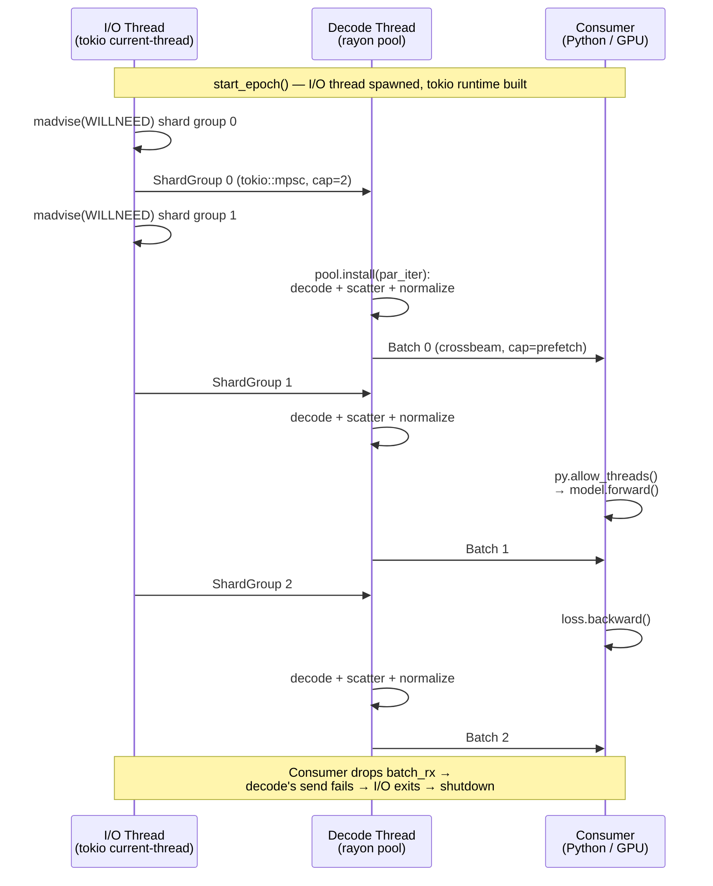

# Multithreading in SCX

SCX is designed to exploit multicore CPUs at every stage — reading, querying,
training, and cloud I/O. This guide explains where parallelism is used, which
runtimes are involved, and how it all stays safe.

## Overview

| Component | Threading model | Key crate(s) |
|-----------|----------------|---------------|
| **Shard decode** (read) | Rayon data parallelism + SIMD BitPacker4x | `scx-format-io` (default), `scx-engine` |
| **Query engine** | Rayon `par_iter` with shard retry | `scx-engine` |
| **Training loader** | Triple-buffered pipeline (tokio + rayon + std::thread) | `scx-loader` |
| **Streaming ingest** (h5ad/h5mu → SCX) | Rayon worker pool + crossbeam reorder buffer | `scx-convert` |
| **Streaming export** (SCX → h5ad/h5mu) | Rayon worker pool + crossbeam reorder buffer | `scx-convert` |
| **Analysis accelerators** | Rayon `par_iter` / `par_chunks` per op | `scx-accel` |
| **Cloud I/O** | Tokio async tasks | `scx-cloud` |
| **File mutations** | Advisory `flock()` via `fs4` | `scx-ops` |
| **GPU decode** | CUDA kernel parallelism | `scx-gpu` |
| **Shard encoding** (write) | Rayon `par_iter` over shard boundaries | `pyscx` |
| **File writing** (I/O) | Sequential (atomic rename) | `scx-format-io` |

## Parallel shard decode

SCX's sharded layout (see [`docs/sharding.md`](sharding.md)) makes parallelism
natural: each shard is independently decompressible with its own header, codec,
and checksum.

### scx-format-io (`parallel` feature — enabled by default)

`ScxReader::read_all_csr_shards()`, `ScxReader::read_layer()` and
`ScxReader::read_all_raw_csr_shards()` use rayon's `par_iter()` to decode shards
concurrently via `assemble_row_major(.., RowMajorStrategy::Parallel)`. Each
shard's slices of the merged output buffers are carved with `split_at_mut`
before the loop starts, so the fan-out needs no `unsafe` and no bounds
`assert!`: the borrow checker has already proved the regions disjoint.
Each shard is independently decompressible — the reader issues `MADV_SEQUENTIAL`
on the shard byte range before the parallel decode loop. Within each shard,
FOR-BP index decode uses SIMD BitPacker4x (4 × 32-element blocks) for rows
with ≥128 non-zeros, further reducing per-shard decode time. The parallel
feature is part of the `default` features:

```toml
# Cargo.toml
[features]
default = ["parallel", "deletion-vectors"]
parallel = ["rayon"]
```

Downstream crates that depend on `scx-format-io` with `default-features = true`
(the Cargo default) get parallelism automatically. Disabling the feature falls
back to sequential decode, which is useful for single-shard use cases or when
keeping `scx-format-io` lightweight.

#### Bounded ordered decode-prefetch (`scx_format_io::prefetch`)

`read_all_csr_shards()` above decodes shards concurrently and returns the whole
matrix. The *streaming* kernels cannot do that — they visit one shard at a time
precisely so peak memory stays at one shard — so they use a different shape:
`for_each_shard_ordered{,_uncached}` decodes up to `depth` shards concurrently
on the rayon pool while invoking the consumer **on the calling thread in strict
shard order**. Decode overlaps reduction and runs across shards; the reduction
still sees the exact sequential accumulation order, so results stay
bit-identical.

It lives here (rather than in `scx-accel`, where Phase 2.1 wrote it) because
`scx-format-io`'s own backed aggregations and `scx-gpu`'s staging pipeline are
two of its three consumers and both sit below `scx-accel` in the crate graph.
`scx_accel::prefetch` re-exports the whole surface, so accelerator call sites
and the `SCX_ACCEL_PREFETCH_DEPTH` / `SCX_ACCEL_REDUCTION_MODE` knobs are
unchanged — those knobs now also govern the backed aggregation kernels
(`row_sums`, `col_sums`, `col_var`, the QC/filter passes, …), pyscx's
column-projected and lazy/transformed twins, the streaming DE kernels, and
GPU staging.

Two constraints on callers:

- **Not from inside a rayon parallel region.** The drain blocks the calling
  thread on the channel while decode tasks run on other pool workers; a
  saturated pool worker calling in would deadlock. The primitive detects a
  worker-thread caller (`rayon::current_thread_index().is_some()`) and decodes
  sequentially instead, but "top-level only" is the contract.
- **Peak memory scales with `depth`** (default 4) — that many decoded shards can
  be live at once, versus one for the sequential loop. New shards are spawned
  only as one drains, so the bound holds even under a head-of-line stall.
  The bound is **per invocation**, not per process: the depth is a global
  `OnceLock`, so *N* concurrent callers hold up to *N* × `depth` decoded shards.
  That is reachable from Python — `pyscx.accel.col_*` release the GIL — and
  nothing caps the aggregate.

Without the `parallel` feature the front-ends still exist and fall back to a
plain sequential loop, so no call site needs a `cfg`.

### scx-engine (always parallel)

The query engine decodes candidate shards in parallel via
`par_map_with_shard_retry`, which wraps rayon's `par_iter` with transient-failure
tolerance:

```text
par_map_with_shard_retry(&needed, |shard| {
    decode_shard → filter_rows → Ok(csr_arrays)
})
```

Pass 1 runs `par_iter` over all candidate shards without short-circuiting on the
first error. If some shards fail with a retryable error (I/O, transient cloud),
they are retried once **sequentially** to let congestion clear. Deterministic
decode errors (corrupt data) fail fast without retry. This prevents a single
shard's transient failure from discarding work already completed on other shards.

Catalog-level predicate pushdown first prunes shards that can't contain matching
cells, so only candidate shards are decoded — parallelism multiplied by
selectivity.

## Training data loader (triple-buffered pipeline)

The `scx-loader` crate implements a three-stage pipeline that keeps the GPU
saturated by overlapping I/O, decode, and consumption:

```
┌──────────────────┐    tokio::mpsc     ┌──────────────────┐   crossbeam   ┌───────────────┐
│  Stage 1: I/O    │ ─────────────────→ │  Stage 2: Decode │ ───────────→  │  Stage 3:     │
│  (std::thread +  │   ShardGroup       │  (std::thread +  │   Batch       │  Consumer     │
│   tokio current_ │                    │   per-pipeline   │               │  (Python/GPU) │
│   thread RT)     │                    │   rayon pool)    │               │               │
└──────────────────┘                    └──────────────────┘               └───────────────┘
```

The following sequence diagram shows how the three stages overlap in time:



### Stage 1: I/O (dedicated `std::thread` + tokio current-thread runtime)

The I/O stage runs on a dedicated OS thread (`scx-io`) that builds and drives
its own `tokio::runtime::Builder::new_current_thread()` runtime via `block_on`.
Shard groups are sent through a bounded `tokio::sync::mpsc` channel
(capacity 2) to provide read-ahead without unbounded buffering. The runtime's
lifetime is bounded by the I/O thread — it is constructed inside the thread
closure on each `start_epoch` call and dropped when the thread exits, so
`TrainingPipeline` itself holds no long-lived runtime between epochs. This
restructuring replaces the original `new_multi_thread().worker_threads(2)`
field-on-pipeline runtime with a model that is fork-safe by construction.

Both the shard reads and the coalesced `MADV_WILLNEED` hints — this group's
byte range plus that of the next `PREFETCH_LOOKAHEAD` groups — are issued
inside `tokio::task::spawn_blocking`, never in the async body: `advise_willneed`
is a blocking `madvise(2)`, and [Why three runtimes?](#why-three-runtimes)
below says the reactor thread makes no blocking syscall. Which groups get
hinted, in what order, is
`io_stage::advise_ranges_for_group` — split out as a pure function because a
hint has no in-process observable effect, so the window and the ordering are
the only parts a test can pin.

The shard indices the shuffler produces are **positions in the selected
modality's CSR shard list**, resolved through `FullCatalog::csr_shard_indices`
— one call, derived once per epoch and shared with the per-group blocking
closures as catalog positions (a `&FullCatalogEntry` borrows the reader and
cannot cross a `'static` closure). `start_epoch` builds its shuffle keys from
the same call and checks the length against the shard count the shuffler was
built for, because `shuffle_epoch_sorted` reads keys with
`sort_keys.get(idx).unwrap_or(u64::MAX)` and a disagreement would otherwise
degrade the ordering silently.

### Stage 2: Decode (std::thread + per-pipeline rayon pool)

A dedicated OS thread (`scx-decode`) receives shard groups and dispatches
the per-row sparse-to-dense scatter + HVG projection + fused normalize+log1p
to a **per-`TrainingPipeline` `rayon::ThreadPool`** via `pool.install(...)`.
The pool is built lazily inside `start_epoch`, sized by
`pool::resolve_pool_threads` — the same function that sizes `cpu_pool()`, so
`SCX_LOADER_CPU_THREADS` governs both — persisted across epochs for the same
`TrainingPipeline`, and dropped in `shutdown()` / `Drop`. Completed batches are sent through a bounded
`crossbeam` channel (capacity = `prefetch_batches`, minimum 2).

> [!IMPORTANT]
> The decode stage **must not** call `rayon::par_*` against the process-global
> registry. Under PyTorch fork-mode DataLoader workers, the parent's global
> rayon pool is inherited as a data structure but its worker threads are not
> duplicated by `fork()` — dispatch deadlocks forever in
> `LockLatch::wait_and_reset`. The per-pipeline pool sidesteps this entirely:
> it is constructed *inside the worker process* on the first `start_epoch`
> call.

### Stage 3: Consumer (Python main thread)

`TrainingDataset.__next__()` calls `py.allow_threads()` to release the GIL
while pulling the next batch from the channel, allowing PyTorch CUDA threads to
run concurrently.

### Shutdown contract

`TrainingDataset.close()` (Python) calls `TrainingPipeline::shutdown()`
(Rust), which drops the batch receiver, joins the I/O and decode threads
under a 5 s deadline (`join_handle_bounded`; on timeout the thread is
detached and a `tracing::warn!` is logged), and drops the per-pipeline
rayon pool. `Drop` runs the same flow as a fallback. Both stages return
`LoaderError::ChannelError` on the natural shutdown propagation chain
(consumer drops `batch_rx` → decode's crossbeam send fails → decode exits
→ tokio mpsc closes → I/O thread's send fails → I/O exits → runtime
drops); that error is filtered out at `join_epoch_handles` so it never
reaches callers.

### Fork safety

The pipeline is fork-safe under
`torch.utils.data.DataLoader(num_workers > 0, start_method="fork")` **when
the dataset is constructed lazily inside the worker's `__iter__`**. The tokio
current-thread runtime (per-epoch, lives on the I/O thread) and the
per-pipeline rayon `ThreadPool` (lazily built on first `start_epoch`) are both
constructed inside the worker process, so a forked child inherits no
fork-hostile state from the parent. The eager-construct-then-fork case is
caught by the PID check in `__next__` (`scx-loader/src/python/`, one per
dataset class).

`TrainingPipeline::new` is **not** thread-free, though: it runs `read_obs` (and
the PFlog α estimate) through `cpu_pool()`, which builds that pool. So a
constructed-but-not-yet-iterated pipeline already owns worker threads — they are
just this process's own, built after the fork, which is the property that
matters. Earlier text here claimed the value held no worker threads at
construction; that stopped being true when the constructor started using a
pool.

#### The other three surfaces: `scx_loader::pool::cpu_pool()`

`TrainingPipeline`'s per-pipeline pool covers only `TrainingPipeline`.
`IndexPlanDataset`, `SparseCellSetDataset` and the two standalone kernels
(`pyscx.collate_cellset_gathered`, `pyscx.downsample_counts_csr`) reached the
**global** registry and hung a forked worker the same way. Two of those paths
run through `scx-format-io` rather than any `par_*` in this crate, which is why
"the loader does not use rayon" was believed and was wrong:

| Path | Reached via |
|---|---|
| `IndexPlanLoader::new` → `ScxReader::read_obs` | the sharded-obs-metadata `par_iter`; fires at **construction** on any file whose obs is sharded |
| gather → `BackedCsrReader::warm_shards` | the parallel cold-shard decode |
| `collate_gathered`, `downsample_counts_csr` | `par_chunks_mut` / `into_par_iter` directly |

All four now go through **`scx_loader::pool::cpu_pool()`** — one pool per
process, shared by every reader, sized `num_cpus::get_physical().clamp(1, 8)`
and overridable with **`SCX_LOADER_CPU_THREADS`**. It is keyed on the PID and
rebuilt when that changes, because a plain `OnceLock` filled by the parent
would hand the child a private pool whose threads are just as absent as the
global one's. `BackedCsrReader::set_cpu_pool` carries it into `scx-format-io`;
unset (every other consumer) keeps the global registry, so `scx-accel`,
`scx-ops`, `scx-engine` and `scx-cli` are unchanged.

The slot is a lock-free `AtomicPtr` to a **never-freed** entry, and that is
load-bearing rather than an optimisation. Dropping the inherited pool would call
`ThreadPool::drop` → `Registry::terminate` → `Sleep::wake_specific_thread`,
which locks each worker's `is_blocked` mutex — inheritable in the locked state
from a parent worker that no longer exists. A `Mutex` guarding the slot has the
same problem one level up. Both would hang the child before it ever used the
fresh pool, so the child neither locks nor destroys inherited state; it leaks
one small entry per fork generation instead.

The kernels are bare `#[pyfunction]`s, so a forked worker calls them with no
dataset in hand and no PID check in front of them — the pool is the only guard
there.

#### Per-worker thread footprint

A `TrainingDataset` worker holds **two** rayon pools, not one: `cpu_pool()`,
built when the constructor runs `read_obs` / the PFlog α estimate, and the
per-`TrainingPipeline` decode pool built in `start_epoch`. They are separate on
purpose — the decode pool is per-instance and released by `close()` / `Drop`,
while `cpu_pool()` is process-wide — so budget `2 × threads` per worker, times
`num_workers`. Both are sized by `resolve_pool_threads`, so
`SCX_LOADER_CPU_THREADS` caps each of them; before that they could diverge,
since the decode pool read `num_cpus::get_physical()` directly and ignored the
knob. `IndexPlanDataset` and `SparseCellSetDataset` hold only `cpu_pool()`.

#### Teardown never runs under the GIL

pyo3 drops a `#[pyclass]` with the GIL held, and dropping a tokio runtime blocks
until every already-started `spawn_blocking` returns — for these loaders, a
`read_shard_cached_arc` decode that can be hundreds of megabytes of Pcodec. All
four dataset classes therefore detach the GIL around teardown, in both `close()`
and `Drop`, and bound the wait by `SHUTDOWN_DEADLINE` (5 s) —
`TrainingPipeline::shutdown` for the two training classes, and for the other two
the mechanism below.

The batch iterators must do the same, and for a reason easy to miss: each holds
its own `Arc` to the loader, so in the ordinary
`for b in ds.iter_with_plans(...)` shape the iterator outlives `ds.close()` in
the caller's frame and is the object that actually releases the runtime. That
covers the GIL half.

**The deadline is not enforced by any of those owners.** It lives in
`BoundedRuntime` (`scx-loader/src/runtime.rs`), the newtype the runtime is
stored in, whose `Drop` calls `shutdown_timeout`. The reason is worth recording,
because the obvious alternative was tried and is wrong: "whoever holds the last
`Arc` calls shutdown" needs each owner to know it is last, which means
`Arc::into_inner`, which is only sound if you can enumerate every holder. Twice
here you could not —

* `PlanPrefetchIter` stores the caller's `process` closure, and
  `SparseCellSetLoader::iter_with_plans` builds that closure around an
  `Arc<SparseCellSetLoader>` holding another engine `Arc`. A `Drop` body runs
  *before* its struct's fields, so the closure was still alive and
  `Arc::into_inner` failed **deterministically** on the production path.
* `IndexPlanIter`'s prefetch tasks captured the whole loader. An already-started
  `spawn_blocking` cannot be aborted, so the task outlived the drop and released
  the final reference itself — from a runtime thread. (That iterator is gone;
  the pair loader runs on `PlanPrefetchIter` too. The hazard is not — it just
  moved down a level, to a task capturing the `Arc<PrefetchEngine>` that owns
  the runtime.)

With the deadline in the runtime's own `Drop`, every release path bounds itself,
including ones nobody enumerated. The remaining obligation is narrow and local:
a runtime must not be dropped from one of its own threads, which is why
prefetch tasks now capture `Arc<BackedCsrReader>` and never the loader or the
engine (`a_prefetch_task_does_not_capture_the_loader` pins both counts).

`pyscx/tests/test_fork_safety.py` is the durable regression test;
post-fix Lambda HPC measurements confirm the workers0 / workers2 paths
run cleanly end-to-end. 
See `comprehensive/results/baselines/LATEST/summary.json` for the canonical
`ml_loader` floors once the next baseline is promoted (the Lambda-side
calibration sets `pyscx_training_dataset_workers2{,_persistent}`
floors to 0.5× the post-fix median per the gate's convention).

### Why three runtimes?

| Runtime | Reason |
|---------|--------|
| tokio (current-thread, per I/O thread) | Async I/O with efficient epoll/io_uring integration; per-thread runtime keeps the fork-hostile thread count at zero |
| rayon (per-pipeline pool for `TrainingPipeline`; the process-wide `pool::cpu_pool()` elsewhere) | Work-stealing for CPU-bound decode/normalize, isolated from the global registry — whose worker threads do not survive `fork()` |
| std::thread | Bridges async and sync worlds without blocking the tokio reactor |

> [!IMPORTANT]
> tokio is used for I/O only; rayon is used for CPU work. They never share
> mutable state — bounded channels provide back-pressure and isolation.

## Cloud I/O

`scx-cloud` uses a tokio multi-thread runtime for parallel cloud operations:

- **`pull()`**: Downloads sections in batches of `parallelism` (default: 8)
  concurrent async tasks, then writes them sequentially to the output file.
- **`push()`**: Uploads sections in parallel async tasks to the cloud backend.
- **`pull_filtered()`**: Same parallel download pattern, but only for shards
  matching a predicate — skipped shards are never downloaded.

```python
# Python: 8 parallel download tasks by default
pyscx.pull("gs://bucket/atlas.scxd/", "atlas.scx")
```

## Concurrent file access

### Reads: no locks needed

SCX uses memory-mapped I/O (`mmap`) for reads. The immutable-fragment file
design means readers always see a consistent snapshot of the file — no read
locks are ever acquired. Multiple processes, notebooks, or training jobs can
read the same `.scx` file simultaneously.

### Writes: advisory `flock()`

Mutating operations (append, delete, compact, merge, rollback) acquire advisory
file locks via the `fs4` crate before modifying a file:

| Lock type | Used by | Blocks |
|-----------|---------|--------|
| **Exclusive** (`FileLock`) | append, delete, rollback | Other writers |
| **Shared** (`SharedFileLock`) | compact, merge (on source files) | Exclusive writers |

Locks are released automatically when the `FileLock` / `SharedFileLock` guard
is dropped. On network filesystems where `flock()` is unavailable, advisory
locks degrade gracefully — readers are never blocked.

> [!TIP]
> Unlike HDF5's mandatory POSIX locks, SCX's advisory locks never cause
> `errno 37` ("No locks available") on NFS/Lustre/GPFS.

## Streaming conversion (parallel ingest and export)

The `scx-convert` crate parallelises both h5ad/h5mu → SCX (ingest) and
SCX → h5ad/h5mu (export) shard processing via rayon worker pools.

### Parallel streaming ingest (h5ad/h5mu → SCX)

`run_streaming_writer_coordinator` in `scx-convert/src/pipeline/coordinator.rs` routes
to `streaming_writer_coordinator_parallel` when `reader_threads > 1`, the
reader supports indexed row-range reads, and libhdf5 is thread-safe
(`H5is_library_threadsafe` probe). The parallel coordinator:

1. Builds a per-coordinator `rayon::ThreadPool` with `reader_threads` workers
   (thread name prefix `scx-stream-`).
2. Partitions the input into row ranges matching `shard_target_rows`.
3. Fans shard read → sort → encode work out via `rayon::in_place_scope`,
   using a **rolling-window spawn** that caps outstanding shards at
   `reader_threads + writer_queue_depth` — one replacement worker per
   shard *written*, not per shard received. That distinction is the
   bound: spawning on receive caps `spawned − received`, while the
   reorder buffer holds `received − written`.
4. A bounded `crossbeam` reorder buffer drains encoded shards in shard-index
   order on the calling thread, which performs sequential writes to the
   `ScxWriter`. Output is byte-identical to the sequential path.
5. **Memory-budget derate**: `derate_threads_and_depth` shrinks both the
   worker count and queue depth to fit under `--memory-budget`, emitting a
   `ReaderThreadsDerated` warning when active.

Fallback to sequential when: `reader_threads <= 1`, reader is not indexed
(e.g., CSC external-memory transpose, h5mu cross-modality), or libhdf5 is
not thread-safe (emits `ConvertWarning::Hdf5NotThreadsafe`).

```python
# Python: parallel ingest with 8 reader threads
pyscx.from_h5ad("atlas.h5ad", "atlas.scx", reader_threads=8, memory_budget=8_000_000_000)
```

### Parallel streaming export (SCX → h5ad/h5mu)

`stream_csr_to_group_at` in `scx-convert/src/h5ad/stream_write.rs` routes to
`stream_csr_into_prealloc_parallel` when `reader_threads > 1`. The parallel
exporter:

1. Builds a per-export `rayon::ThreadPool` with `reader_threads` workers
   (thread name prefix `scx-export-`).
2. Workers decode + filter shards in the rayon pool; the calling thread
   drains the bounded crossbeam channel in shard-index order and performs
   HDF5 hyperslab writes (libhdf5 holds its own global lock, but workers
   never touch HDF5).
3. No `H5is_library_threadsafe` probe is required — per-shard memory comes
   from exact `FullCatalogEntry::stats.nnz` and row range (no density
   heuristic). Same rolling-window spawn cap as ingest.

Both directions are the same code: `scx-convert/src/parallel_drain.rs`'s
`ordered_parallel_drain` owns the pool, the bounded channel, the reorder
buffer, the spawn placement, the panic-to-`Err` conversion and the
receiver-drop that releases parked workers. Each coordinator supplies only
its worker body, its per-item error envelope, and its sink. The drain is
generic over the item and error types and carries no `hdf5` gate, so its
tests run in the default `cargo test --workspace` job.

```python
# Python: parallel export
pyscx.to_h5ad("atlas.scx", "atlas.h5ad", reader_threads=8)
```

## Analysis accelerators

The `scx-accel` crate parallelises CPU-side analysis via rayon. Each
accelerator uses rayon's global thread pool or a locally-scoped pool:

| Accelerator | Threading model |
|-------------|----------------|
| **PCA** (covariance / randomized) | Bounded ordered decode-prefetch on the global pool; covariance and transpose SpMM partition their **output** columns across workers into one shared accumulator (no merge); row-disjoint `par_chunks_mut` for the forward SpMM |
| **Differential expression** (Wilcoxon rank-sum, pdex ref-mode, the `pts` counting pass) | `par_iter` over genes for the ranking; on a backed or lazy `X` the shard walk goes through the bounded ordered decode-prefetch — per gene chunk for Wilcoxon and pdex, once over the matrix for `pts`, so a row projection skips the shards it empties and decode overlaps the ranking. Depth is granted from whatever the dense `n_obs x chunk` workspace left of `SCX_ACCEL_DE_MEMORY_BUDGET` |
| **NB-GLM** (DESeq2-style DE) | `par_iter` over genes for IRLS, shrinkage refit, and Wald inference |
| **Harmony** batch integration | Per-op `rayon::ThreadPool`; tiled cell updates via `par_chunks` |
| **Leiden** clustering | Conflict-free parallel batching via `par_iter` |
| **kNN** (HNSW) | `par_iter` over query points; faer `Par::rayon(0)` for matmul |
| **LISI** | `par_iter` over cells |
| **HVG** (seurat_v3 / seurat) | Streaming shard-parallel gene statistics |
| **Gene-set scoring** (`score_genes`) | Streaming shard-parallel mean/score computation |
| **Pseudobulk** aggregation | Streaming shard-parallel group sums |
| **Perturbation eval metrics** | `par_iter` over perturbations; faer `Par::rayon(0)` for distance matmul |

Harmony builds an isolated `rayon::ThreadPool` scoped to the op to avoid
contention with the global pool. All other ops, PCA included, use the
process-global rayon registry (controllable via `RAYON_NUM_THREADS`).

PCA used to be the one accelerator running on **two pools at once**, with a
private pool for the covariance accumulation. That pool existed to bound
memory — it held one `n_vars × n_vars` accumulator per worker — and went away
when the reductions started partitioning their output instead of their input:
there is one shared accumulator now, so there is nothing left to bound that way.
Its shard loops — the fused column-means pass, the covariance build, the
covariance embeddings pass, both streaming SpMM passes — still deliver through
the bounded ordered decode-prefetch pipeline, and the reduction now enters the
global pool from inside the consume closure, exactly as the embeddings pass
already did. Depth is `SCX_ACCEL_PREFETCH_DEPTH` (default 4) additionally lowered
by `SCX_ACCEL_NUM_THREADS`, which also caps the column-block count — so on PCA
that knob bounds speed and memory and provably cannot change the numbers (see
[scanpy.md § PCA reproducibility](scanpy.md#reproducibility)). The
decoded-but-unconsumed shards are reserved out of `pca(memory_budget=…)` rather
than added on top of it.

> `errno 37` ("No locks available") on NFS/Lustre/GPFS.

## File writing

File writing has two phases: parallel encoding followed by sequential I/O.

1. **Shard encoding (parallel)**: `parallel_encode_csr_shards` in pyscx uses
   rayon `par_iter()` to encode all shards concurrently — compression,
   BLAKE3 checksumming, and statistics computation all run on separate threads.
   This achieves up to **3.2x speedup** at 32 threads for compression-heavy
   codecs (pcodec, zstd) on 500K+ cell datasets.

2. **Disk I/O (sequential)**: `ScxWriter` writes pre-encoded sections
   sequentially to a temporary file, then performs `fsync()` + `rename()` for
   atomic visibility. This guarantees readers never see a partially-written file.

## GPU parallelism

The `scx-gpu` crate launches CUDA kernels with hundreds of GPU threads:

| Kernel | Parallelism |
|--------|-------------|
| Rice decode | One CUDA thread per Rice block (256 values) |
| FOR-BP index decode | One CUDA thread per FOR-BP block (128 rows) |
| Sparse-to-dense | One warp (32 threads) per CSR row |
| Cast (u8/u16 → f32) | One CUDA thread per element |

This is GPU parallelism rather than CPU multithreading — the CPU side launches
kernels and manages memory transfers.

### Host-side staging (`GpuShardSource`)

Feeding those kernels is a host-side pipeline, and it used to be the bottleneck:
a single scoped `std::thread` decoded shard *i+1* through a `sync_channel(1)`
while the main thread staged and uploaded shard *i*. One CPU decode thread
feeding an H100 makes every GPU streaming op host-decode-bound.

It now uses the shared [bounded ordered decode-prefetch](#bounded-ordered-decode-prefetch-scx_format_ioprefetch)
above, so `depth` shards decode concurrently while consumption stays on the
calling thread in shard order — which is exactly what the pinned 2-slot ring and
the copy/compute event handshake already assumed, so none of that device-side
machinery changed. Decode time is attributed through a `ProfiledDecode` adapter
on the source; as on the CPU side, the reported total sums concurrent workers
and can exceed wall-clock, so read it as a ratio against wall rather than an
absolute.

The pinned and device staging buffers are pre-sized from
`ShardSource::shard_size_hint()` when the source can answer cheaply — a backed
reader reads the bound straight from catalog statistics, so no shard is decoded
to obtain it — which removes the grow-and-realloc the staging slots used to do
on the first shard. The same hint gives the depth clamp a real per-shard byte
estimate, so `SCX_GPU_STAGING_MEMORY_BUDGET` (bytes) can bound the
decoded-but-unconsumed set. Unset, nothing is derated.

Per-shard validation (`shard_validate::validate_shard`, up to three O(nnz)
host scans enforcing the in-range, strictly-increasing and finiteness contracts
the kernels depend on) runs on the consuming thread and is rayon-parallel above
65 536 nnz. Which of the three run is the consumer's `ValidationChecks` — three
independent switches, not a ladder, because the requirements do not nest: DE
asks for all three; PCA and pseudobulk for sorted-without-finite; HVG's clipped
reducers for finite-without-sorted; `normalize_total` / `log1p` and HVG's plain
mean/variance for neither, which on a row-major shard is no scan at all. It reduces by **minimum row index** rather than stopping at the
first offender any worker finds, so the error still names the same position the
serial scan named — an error message that changes under load is not one a user
can act on.

### GPU DE device residency

The GPU DE CSR route iterates the source once per gene chunk. When the matrix
fits a fraction of free VRAM, `ResidentGpuCsrSource` drains it once into
per-shard device buffers and replays those, so host decode and H→D happen
`n_shards` times rather than `n_gene_chunks × n_shards`. Shards are retained
separately rather than concatenated: the DE kernels take a per-shard view plus a
`global_row` offset, so the callback sees the identical shard sequence, shapes
and launch geometry it saw while streaming. See
[scanpy.md § GPU DE device residency](scanpy.md#gpu-de-device-residency).

## Thread safety of key types

| Type | Thread-safe? | Notes |
|------|-------------|-------|
| `ScxReader` | `Send + Sync` | Backed by `mmap` (immutable `&[u8]`). Internal `Arc<FullCatalog>` is also `Send + Sync`. Safe to share via `Arc<ScxReader>` across threads or to reopen sibling readers with `ScxReader::open_with_shared_catalog`. |
| `FullCatalog` / `CatalogView` | `Send + Sync` | Frozen after parse. `FullCatalog::reconcile_v1_csr_col_range` runs once before the `Arc` wrap; afterward both types are immutable. Only `FullCatalog` is shared through an `Arc` today — reader paths build `CatalogView`s as stack temporaries. See [Fork safety](#fork-safety) for the constraints any future memoisation must respect. |
| `BackedCsrReader` | `Send + Sync` | `mmap`-backed catalog data + a per-instance `ShardCache` (byte-budgeted `WeightedLruCache` + singleflight `Mutex`). **Must remain per-process** — see [Why mutable reader state stays per-instance](#why-mutable-reader-state-stays-per-instance). |
| `ScxWriter` | `Send` only | Single-owner, sequential writes. Not shared across threads. |
| `QueryPipeline` | `Send` | Built on one thread, executed on another. Not shared. |
| `TrainingPipeline` | `Send` | Owns its tokio runtime and thread handles. Called from one thread at a time. |
| `FileLock` | `Send` | Lock transferred to a single owner. Released on drop. |
| `numpy::PyReadonlyArray*` | **No** | A *view* into a buffer Python can still write. The borrow is not GIL-bound and does not clear numpy's `WRITEABLE` flag, so its `&[T]` must never be read after the GIL is released — copy into an owned `Vec` / `Arc<[T]>` first (`crate::convert::owned_csr`). See [Coding conventions § Python Bindings](conventions.md#python-bindings-pyscx). |

### Why mutable reader state stays per-instance

`BackedCsrReader` holds two pieces of fork-hostile state that must never be
shared across forked workers:

- The `WeightedLruCache` of decoded shards. Its `parking_lot::Mutex`-protected
  internal linked list can be held by a thread at the instant of `fork()`. The
  child inherits a held lock with no owning thread; the next acquire
  deadlocks. This is the same family of bugs that motivates `pthread_atfork`
  handlers; `parking_lot` does not register any.
- The singleflight table that deduplicates concurrent decode requests. Its
  `Mutex<HashMap<ShardKey, ...>>` is held during decode dispatch. Same
  inherit-held-lock failure mode as the LRU cache.

Both live in one `ShardCache`, and **`BackedCscReader` and `BackedDenseReader`
hold one too** — so the constraint is not the CSR reader's alone. The CSC reader
in particular gained a singleflight table when the three caches were unified; it
previously had only a count-capped LRU. Every one of them is per-instance, never
a process-global `OnceCell` / `static`, which is what keeps a forked
`DataLoader` worker constructing its own readers safe.

`mmap`-backed memory and the `Arc<FullCatalog>` payload that reader-open
paths reuse are immutable, so they survive `fork()` cleanly
and are the **only** state that may be shared across worker boundaries.
Anything that allocates or takes a lock during reads — caches, decompression
buffers, singleflight maps, open file descriptors that hold OS-level locks —
stays per-instance.

### Catalog sharing within a process

`pyscx::to_anndata_backed` opens N+3 sibling `ScxReader` instances per call
(main reader + X CSR + CSC sidecar + one per backed layer). Each shares the
parent's parsed catalog via `ScxReader::open_with_shared_catalog`, which
takes an `Arc<FullCatalog>` produced by `ScxReader::catalog_arc()`. The
shared catalog cuts catalog-parse cost from `O(N+3)` to `O(1)` per call; the
per-instance mmap, shard cache, and singleflight table stay independent so
fork safety is preserved.

The Arc is **call-scoped**, not process-global. There is no global registry
or cache of catalogs. Two unrelated calls to `to_anndata(backed=True)` on
the same file parse the catalog twice — by design, so that:

1. Each call's catalog reflects the on-disk state at the moment of open
   (append/compact/rollback semantics from `scx-ops` keep working without
   cache invalidation hooks).
2. No global state needs to survive `fork()`.

### Fork-safety constraints for future catalog memoisation

If cross-call catalog memoisation is added later, the implementation MUST
NOT:

- Cache `BackedCsrReader`, `ScxReader`, or any per-shard cache. Mutable
  reader state is the exact failure mode above.
- Cache file handles or memory-mapped regions across workers — `fork()`
  duplicates the descriptor but POSIX file locks (where present) are
  process-attached, not handle-attached.
- Hold the cache itself behind a lock that may be acquired during a `fork()`
  call. `Arc::clone` on a fully constructed entry is fine; insertion under a
  `Mutex` is not.

It MUST:

- Key on a (path, file length, manifest sequence) tuple — or any equivalent
  identity-triple that mutation invalidates. `manifest_sequence` increments
  on every append / delete / rollback, so it is sufficient as the
  invalidation signal.
- Store only immutable parsed catalog data — `Arc<FullCatalog>`, or an
  `Arc<CatalogView>` if a future caller wants one. Both types are `Send + Sync`
  and frozen after parse; only the `FullCatalog` form is shared today.
- Use weak references or bounded capacity. A long-running worker that opens
  thousands of files must not retain every catalog indefinitely.
- Provide an opt-out (env var or builder switch) for debugging and for
  callers that want to stress the cold-open path.

## How to control parallelism

### Rayon thread pool

By default rayon uses all available CPU cores. To limit:

```rust
// Rust: set global thread pool size
rayon::ThreadPoolBuilder::new()
    .num_threads(4)
    .build_global()
    .unwrap();
```

```python
# Python/Environment: set before importing pyscx
import os
os.environ["RAYON_NUM_THREADS"] = "4"
```

### Tokio worker threads

The training loader's I/O stage uses a `tokio::runtime::Builder::new_current_thread()`
runtime on a dedicated `std::thread` per epoch — there is no multi-threaded tokio
executor. The cloud runtime (`scx-cloud`) uses tokio's default multi-threaded
builder (one thread per core), with download concurrency controlled by
`PullOptions.parallelism`.

### Cloud download parallelism

```python
# Python: control parallel download tasks
pyscx.pull("gs://bucket/atlas.scxd/", "atlas.scx", parallelism=16)
```

```bash
# CLI
scx pull gs://bucket/atlas.scxd/ atlas.scx --parallelism 16
```

## Architecture diagram

```
                         ┌─────────────────────────────┐
                         │        User Code            │
                         │  (Python / R / Rust CLI)    │
                         └──────────┬──────────────────┘
                                    │
          ┌──────────────┬──────────┼──────────┬──────────────┐
          │              │          │          │              │
┌─────────▼────────┐ ┌───▼───────┐ │  ┌───────▼───────┐ ┌───▼────────────┐
│   scx-engine     │ │ scx-accel │ │  │  scx-convert  │ │   scx-cloud    │
│  rayon par_iter  │ │ rayon per │ │  │  rayon pool + │ │  tokio async   │
│  (query decode)  │ │  op/pool  │ │  │  crossbeam    │ │  (cloud I/O)   │
└─────────┬────────┘ └───┬───────┘ │  └───────┬───────┘ └───┬────────────┘
          │              │         │          │              │
          └──────────────┴─────────┤──────────┘              │
                                   │                         │
                         ┌─────────▼─────────┐   ┌──────────▼──────────┐
                         │   scx-loader      │   │                     │
                         │  tokio + rayon    │   │  object_store       │
                         │  + std::thread   │   │  (async range I/O)  │
                         └─────────┬─────────┘   └─────────────────────┘
                                   │
                         ┌─────────▼─────────┐
                         │  scx-format-io    │
                         │  (default rayon)  │
                         │  mmap reader      │
                         └─────────┬─────────┘
                                   │
                         ┌─────────▼─────────┐
                         │   .scx file       │
                         │  (sharded CSR)    │
                         └───────────────────┘
```

For the full crate dependency graph, see [`docs/architecture.md`](architecture.md).
