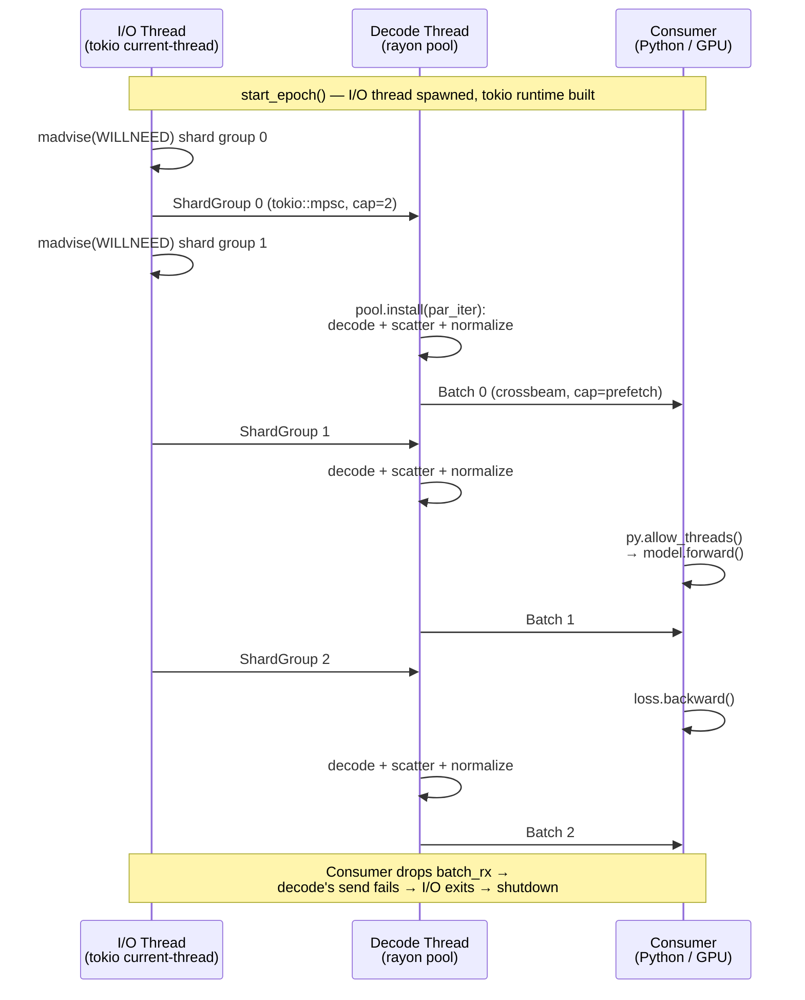

# Multithreading in SCX

SCX is designed to exploit multicore CPUs at every stage — reading, querying,
training, and cloud I/O. This guide explains where parallelism is used, which
runtimes are involved, and how it all stays safe.

## Overview

| Component | Threading model | Key crate(s) |
|-----------|----------------|---------------|
| **Shard decode** (read) | Rayon data parallelism + SIMD BitPacker4x | `scx-format-io` (opt-in), `scx-engine` |
| **Query engine** | Rayon `par_iter` over shards | `scx-engine` |
| **Training loader** | Triple-buffered pipeline (tokio + rayon + std::thread) | `scx-loader` |
| **Cloud I/O** | Tokio async tasks | `scx-cloud` |
| **File mutations** | Advisory `flock()` via `fs4` | `scx-ops` |
| **GPU decode** | CUDA kernel parallelism | `scx-gpu` |
| **Shard encoding** (write) | Rayon `par_iter` over shard boundaries | `pyscx` |
| **File writing** (I/O) | Sequential (atomic rename) | `scx-format-io` |

## Parallel shard decode

SCX's sharded layout (see [`docs/sharding.md`](sharding.md)) makes parallelism
natural: each shard is independently decompressible with its own header, codec,
and checksum.

### scx-format-io (opt-in `parallel` feature)

`ScxReader::read_all_csr_shards()` and `ScxReader::read_layer()` use rayon's
`par_iter()` to decode shards concurrently via `assemble_shards_parallel()`.
Each shard is independently decompressible — the reader issues `MADV_SEQUENTIAL`
on the shard byte range before the parallel decode loop. Within each shard,
FOR-BP index decode uses SIMD BitPacker4x (4 × 32-element blocks) for rows
with ≥128 non-zeros, further reducing per-shard decode time. The parallel
feature is enabled:

```toml
# Cargo.toml
[features]
parallel = ["rayon"]
```

Without the feature flag, the same functions fall back to sequential decode.
This lets downstream crates (e.g., `scx-engine`) always get parallelism while
keeping `scx-format-io` lightweight for single-shard use cases.

### scx-engine (always parallel)

The query engine's `collect()` function always decodes candidate shards in
parallel via rayon:

```text
shard_infos.par_iter()
    .map(|si| decode_shard → filter_rows → Ok(csr_arrays))
    .collect::<Result<Vec<_>>>()?
```

Catalog-level predicate pushdown first prunes shards that can't contain matching
cells, so only candidate shards are decoded — parallelism multiplied by
selectivity.

## Training data loader (triple-buffered pipeline)

The `scx-loader` crate implements a three-stage pipeline that keeps the GPU
saturated by overlapping I/O, decode, and consumption:

```
┌──────────────────┐    tokio::mpsc     ┌──────────────────┐   crossbeam   ┌───────────────┐
│  Stage 1: I/O    │ ─────────────────→ │  Stage 2: Decode │ ───────────→  │  Stage 3:     │
│  (std::thread +  │   ShardGroup       │  (std::thread +  │   Batch       │  Consumer     │
│   tokio current_ │                    │   per-pipeline   │               │  (Python/GPU) │
│   thread RT)     │                    │   rayon pool)    │               │               │
└──────────────────┘                    └──────────────────┘               └───────────────┘
```

The following sequence diagram shows how the three stages overlap in time:



### Stage 1: I/O (dedicated `std::thread` + tokio current-thread runtime)

The I/O stage runs on a dedicated OS thread (`scx-io`) that builds and drives
its own `tokio::runtime::Builder::new_current_thread()` runtime via `block_on`.
Shard groups are sent through a bounded `tokio::sync::mpsc` channel
(capacity 2) to provide read-ahead without unbounded buffering. The runtime's
lifetime is bounded by the I/O thread — it is constructed inside the thread
closure on each `start_epoch` call and dropped when the thread exits, so
`TrainingPipeline` itself holds no long-lived runtime between epochs. This
restructuring replaces the original `new_multi_thread().worker_threads(2)`
field-on-pipeline runtime with a model that is fork-safe by construction.

### Stage 2: Decode (std::thread + per-pipeline rayon pool)

A dedicated OS thread (`scx-decode`) receives shard groups and dispatches
the per-row sparse-to-dense scatter + HVG projection + fused normalize+log1p
to a **per-`TrainingPipeline` `rayon::ThreadPool`** via `pool.install(...)`.
The pool is built lazily inside `start_epoch` via
`rayon::ThreadPoolBuilder::new().num_threads(num_cpus::get_physical().min(8))`,
persisted across epochs for the same `TrainingPipeline`, and dropped in
`shutdown()` / `Drop`. Completed batches are sent through a bounded
`crossbeam` channel (capacity = `prefetch_batches`, minimum 2).

> [!IMPORTANT]
> The decode stage **must not** call `rayon::par_*` against the process-global
> registry. Under PyTorch fork-mode DataLoader workers, the parent's global
> rayon pool is inherited as a data structure but its worker threads are not
> duplicated by `fork()` — dispatch deadlocks forever in
> `LockLatch::wait_and_reset`. The per-pipeline pool sidesteps this entirely:
> it is constructed *inside the worker process* on the first `start_epoch`
> call.

### Stage 3: Consumer (Python main thread)

`TrainingDataset.__next__()` calls `py.allow_threads()` to release the GIL
while pulling the next batch from the channel, allowing PyTorch CUDA threads to
run concurrently.

### Shutdown contract

`TrainingDataset.close()` (Python) calls `TrainingPipeline::shutdown()`
(Rust), which drops the batch receiver, joins the I/O and decode threads
under a 5 s deadline (`join_handle_bounded`; on timeout the thread is
detached and a `tracing::warn!` is logged), and drops the per-pipeline
rayon pool. `Drop` runs the same flow as a fallback. Both stages return
`LoaderError::ChannelError` on the natural shutdown propagation chain
(consumer drops `batch_rx` → decode's crossbeam send fails → decode exits
→ tokio mpsc closes → I/O thread's send fails → I/O exits → runtime
drops); that error is filtered out at `join_epoch_handles` so it never
reaches callers.

### Fork safety

The pipeline is fork-safe under
`torch.utils.data.DataLoader(num_workers > 0, start_method="fork")` **when
the dataset is constructed lazily inside the worker's `__iter__`**. Both
the tokio current-thread runtime (per-epoch, lives on the I/O thread) and
the rayon `ThreadPool` (per-instance, lazily built on first
`start_epoch`) are constructed inside the worker process, so the
`TrainingPipeline` value contains no live runtime, registry, or worker
threads at construction time. A forked child therefore inherits no
fork-hostile state from the parent. The eager-construct-then-fork case is
caught by the PID check in `__next__` (`scx-loader/src/python.rs:134-141`).

`pyscx/tests/test_fork_safety.py` is the durable regression test;
post-fix Lambda HPC measurements confirm the workers0 / workers2 paths
run cleanly end-to-end. 
See `comprehensive/results/baselines/LATEST/summary.json` for the canonical
`ml_loader` floors once the next baseline is promoted (the Lambda-side
calibration sets `pyscx_training_dataset_workers2{,_persistent}`
floors to 0.5× the post-fix median per the gate's convention).

### Why three runtimes?

| Runtime | Reason |
|---------|--------|
| tokio (current-thread, per I/O thread) | Async I/O with efficient epoll/io_uring integration; per-thread runtime keeps the fork-hostile thread count at zero |
| rayon (per-pipeline pool) | Work-stealing for CPU-bound decode/normalize, isolated from the global registry |
| std::thread | Bridges async and sync worlds without blocking the tokio reactor |

> [!IMPORTANT]
> tokio is used for I/O only; rayon is used for CPU work. They never share
> mutable state — bounded channels provide back-pressure and isolation.

## Cloud I/O

`scx-cloud` uses a tokio multi-thread runtime for parallel cloud operations:

- **`pull()`**: Downloads sections in batches of `parallelism` (default: 8)
  concurrent async tasks, then writes them sequentially to the output file.
- **`push()`**: Uploads sections in parallel async tasks to the cloud backend.
- **`pull_filtered()`**: Same parallel download pattern, but only for shards
  matching a predicate — skipped shards are never downloaded.

```python
# Python: 8 parallel download tasks by default
pyscx.pull("gs://bucket/atlas.scxd/", "atlas.scx")
```

## Concurrent file access

### Reads: no locks needed

SCX uses memory-mapped I/O (`mmap`) for reads. The immutable-fragment file
design means readers always see a consistent snapshot of the file — no read
locks are ever acquired. Multiple processes, notebooks, or training jobs can
read the same `.scx` file simultaneously.

### Writes: advisory `flock()`

Mutating operations (append, delete, compact, merge, rollback) acquire advisory
file locks via the `fs4` crate before modifying a file:

| Lock type | Used by | Blocks |
|-----------|---------|--------|
| **Exclusive** (`FileLock`) | append, delete, rollback | Other writers |
| **Shared** (`SharedFileLock`) | compact, merge (on source files) | Exclusive writers |

Locks are released automatically when the `FileLock` / `SharedFileLock` guard
is dropped. On network filesystems where `flock()` is unavailable, advisory
locks degrade gracefully — readers are never blocked.

> [!TIP]
> Unlike HDF5's mandatory POSIX locks, SCX's advisory locks never cause
> `errno 37` ("No locks available") on NFS/Lustre/GPFS.

## File writing

File writing has two phases: parallel encoding followed by sequential I/O.

1. **Shard encoding (parallel)**: `parallel_encode_csr_shards` in pyscx uses
   rayon `par_iter()` to encode all shards concurrently — compression,
   BLAKE3 checksumming, and statistics computation all run on separate threads.
   This achieves up to **3.2x speedup** at 32 threads for compression-heavy
   codecs (pcodec, zstd) on 500K+ cell datasets.

2. **Disk I/O (sequential)**: `ScxWriter` writes pre-encoded sections
   sequentially to a temporary file, then performs `fsync()` + `rename()` for
   atomic visibility. This guarantees readers never see a partially-written file.

## GPU parallelism

The `scx-gpu` crate launches CUDA kernels with hundreds of GPU threads:

| Kernel | Parallelism |
|--------|-------------|
| Rice decode | One CUDA thread per Rice block (256 values) |
| FOR-BP index decode | One CUDA thread per FOR-BP block (128 rows) |
| Sparse-to-dense | One warp (32 threads) per CSR row |
| Cast (u8/u16 → f32) | One CUDA thread per element |

This is GPU parallelism rather than CPU multithreading — the CPU side launches
kernels and manages memory transfers.

## Thread safety of key types

| Type | Thread-safe? | Notes |
|------|-------------|-------|
| `ScxReader` | `Send + Sync` | Backed by `mmap` (immutable `&[u8]`). Internal `Arc<FullCatalog>` is also `Send + Sync`. Safe to share via `Arc<ScxReader>` across threads or to reopen sibling readers with `ScxReader::open_with_shared_catalog`. |
| `FullCatalog` / `CatalogView` | `Send + Sync` | Frozen after parse. `FullCatalog::reconcile_v1_csr_col_range` runs once before the `Arc` wrap; afterward both types are immutable. See [Fork safety](#fork-safety) for the constraints any future memoisation must respect. |
| `BackedCsrReader` | `Send + Sync` | `mmap`-backed catalog data + per-instance `WeightedLruCache` and singleflight `Mutex`. **Must remain per-process** — see [Why mutable reader state stays per-instance](#why-mutable-reader-state-stays-per-instance). |
| `ScxWriter` | `Send` only | Single-owner, sequential writes. Not shared across threads. |
| `QueryPipeline` | `Send` | Built on one thread, executed on another. Not shared. |
| `TrainingPipeline` | `Send` | Owns its tokio runtime and thread handles. Called from one thread at a time. |
| `FileLock` | `Send` | Lock transferred to a single owner. Released on drop. |

### Why mutable reader state stays per-instance

`BackedCsrReader` holds two pieces of fork-hostile state that must never be
shared across forked workers:

- The `WeightedLruCache` of decoded shards. Its `parking_lot::Mutex`-protected
  internal linked list can be held by a thread at the instant of `fork()`. The
  child inherits a held lock with no owning thread; the next acquire
  deadlocks. This is the same family of bugs that motivates `pthread_atfork`
  handlers; `parking_lot` does not register any.
- The singleflight table that deduplicates concurrent decode requests. Its
  `Mutex<HashMap<ShardKey, ...>>` is held during decode dispatch. Same
  inherit-held-lock failure mode as the LRU cache.

`mmap`-backed memory and the `Arc<FullCatalog>` / `Arc<CatalogView>` payloads
that reader-open paths reuse are immutable, so they survive `fork()` cleanly
and are the **only** state that may be shared across worker boundaries.
Anything that allocates or takes a lock during reads — caches, decompression
buffers, singleflight maps, open file descriptors that hold OS-level locks —
stays per-instance.

### Catalog sharing within a process

`pyscx::to_anndata_backed` opens N+3 sibling `ScxReader` instances per call
(main reader + X CSR + CSC sidecar + one per backed layer). Each shares the
parent's parsed catalog via `ScxReader::open_with_shared_catalog`, which
takes an `Arc<FullCatalog>` produced by `ScxReader::catalog_arc()`. The
shared catalog cuts catalog-parse cost from `O(N+3)` to `O(1)` per call; the
per-instance mmap, shard cache, and singleflight table stay independent so
fork safety is preserved.

The Arc is **call-scoped**, not process-global. There is no global registry
or cache of catalogs. Two unrelated calls to `to_anndata(backed=True)` on
the same file parse the catalog twice — by design, so that:

1. Each call's catalog reflects the on-disk state at the moment of open
   (append/compact/rollback semantics from `scx-ops` keep working without
   cache invalidation hooks).
2. No global state needs to survive `fork()`.

### Fork-safety constraints for future catalog memoisation

If cross-call catalog memoisation is added later, the implementation MUST
NOT:

- Cache `BackedCsrReader`, `ScxReader`, or any per-shard cache. Mutable
  reader state is the exact failure mode above.
- Cache file handles or memory-mapped regions across workers — `fork()`
  duplicates the descriptor but POSIX file locks (where present) are
  process-attached, not handle-attached.
- Hold the cache itself behind a lock that may be acquired during a `fork()`
  call. `Arc::clone` on a fully constructed entry is fine; insertion under a
  `Mutex` is not.

It MUST:

- Key on a (path, file length, manifest sequence) tuple — or any equivalent
  identity-triple that mutation invalidates. `manifest_sequence` increments
  on every append / delete / rollback, so it is sufficient as the
  invalidation signal.
- Store only immutable parsed catalog data — `Arc<FullCatalog>` and/or
  `Arc<CatalogView>`. Both are `Send + Sync` and frozen after parse.
- Use weak references or bounded capacity. A long-running worker that opens
  thousands of files must not retain every catalog indefinitely.
- Provide an opt-out (env var or builder switch) for debugging and for
  callers that want to stress the cold-open path.

## How to control parallelism

### Rayon thread pool

By default rayon uses all available CPU cores. To limit:

```rust
// Rust: set global thread pool size
rayon::ThreadPoolBuilder::new()
    .num_threads(4)
    .build_global()
    .unwrap();
```

```python
# Python/Environment: set before importing pyscx
import os
os.environ["RAYON_NUM_THREADS"] = "4"
```

### Tokio worker threads

The training loader's I/O stage uses a `tokio::runtime::Builder::new_current_thread()`
runtime on a dedicated `std::thread` per epoch — there is no multi-threaded tokio
executor. The cloud runtime (`scx-cloud`) uses tokio's default multi-threaded
builder (one thread per core), with download concurrency controlled by
`PullOptions.parallelism`.

### Cloud download parallelism

```python
# Python: control parallel download tasks
pyscx.pull("gs://bucket/atlas.scxd/", "atlas.scx", parallelism=16)
```

```bash
# CLI
scx pull gs://bucket/atlas.scxd/ atlas.scx --parallelism 16
```

## Architecture diagram

```
                         ┌─────────────────────────────┐
                         │        User Code            │
                         │  (Python / R / Rust CLI)    │
                         └──────────┬──────────────────┘
                                    │
              ┌─────────────────────┼────────────────────┐
              │                     │                    │
    ┌─────────▼────────┐  ┌────────▼────────┐   ┌────────▼────────┐
    │   scx-engine     │  │   scx-loader    │   │   scx-cloud     │
    │  rayon par_iter  │  │  tokio + rayon  │   │  tokio async    │
    │  (query decode)  │  │  + std::thread  │   │  (cloud I/O)    │
    └─────────┬────────┘  └────────┬────────┘   └────────┬────────┘
              │                    │                     │
              └────────────────────┼─────────────────────┘
                                   │
                         ┌─────────▼─────────┐
                         │   scx-format      │
                         │  (opt-in rayon)   │
                         │  mmap reader      │
                         └─────────┬─────────┘
                                   │
                         ┌─────────▼─────────┐
                         │   .scx file       │
                         │  (sharded CSR)    │
                         └───────────────────┘
```

For the full crate dependency graph, see [`docs/architecture.md`](architecture.md).
